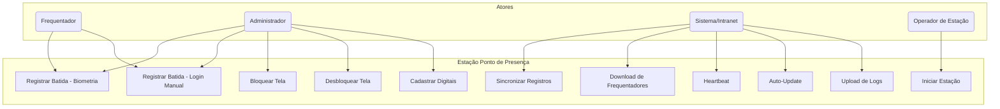
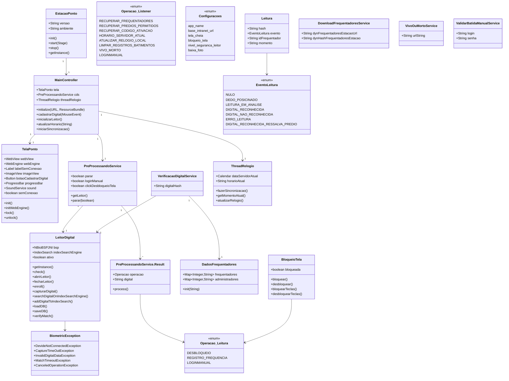
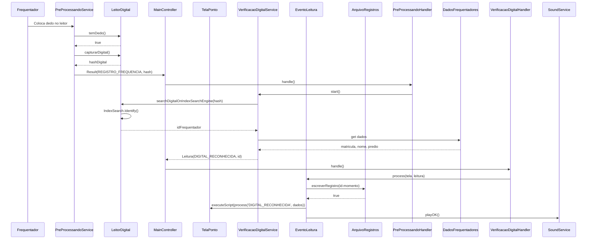
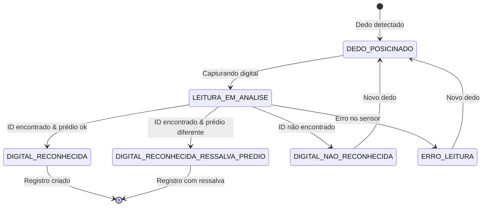
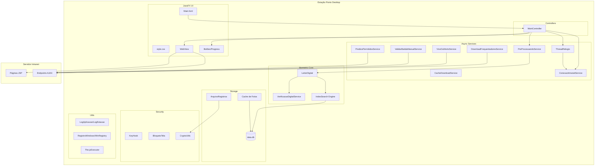
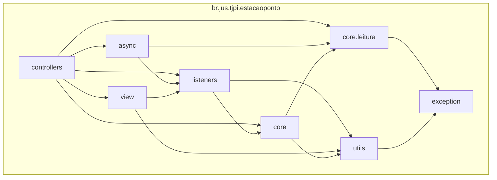
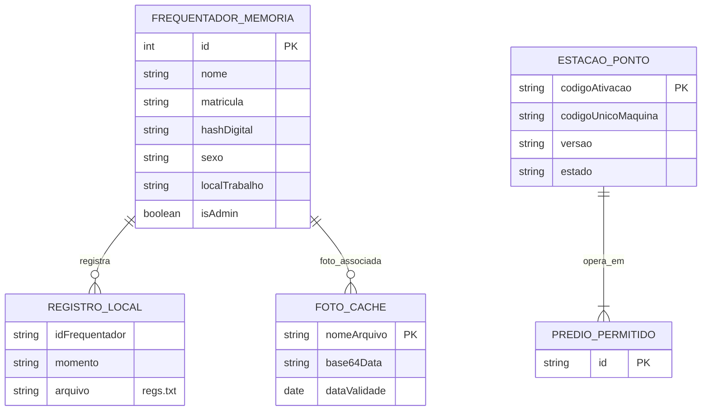
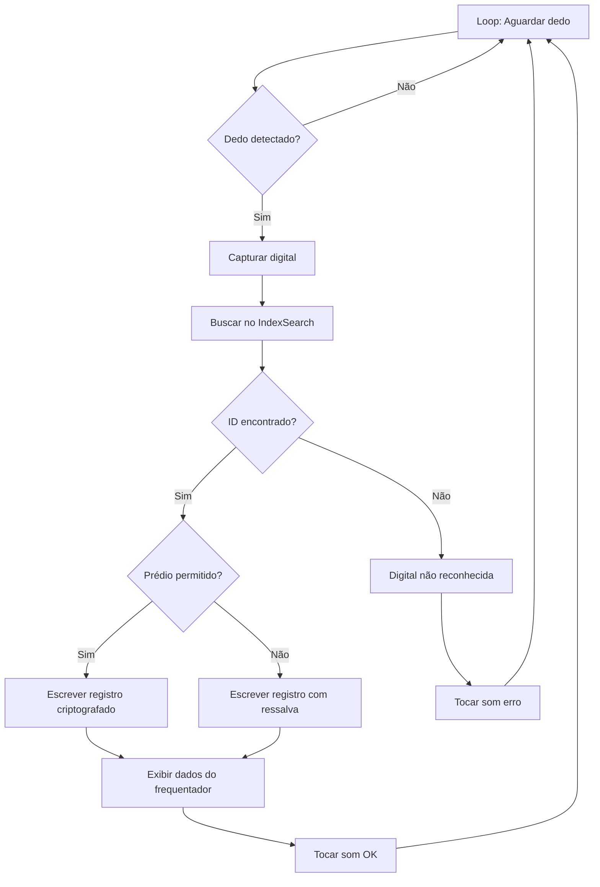
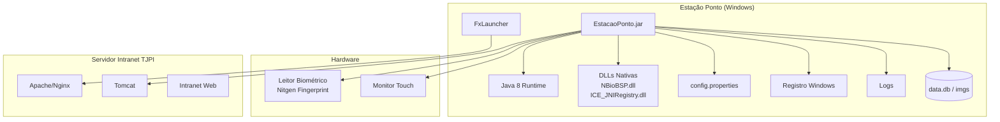

# Documentação Completa — Estação Ponto de Presença (Desktop)

> **Versão do documento:** 1.0  
> **Data:** Julho/2026  
> **Escopo:** Engenharia reversa completa da aplicação desktop `EstacaoPonto`  
> **Repositório:** `estacaoPonto/`  
> **Versão do software:** 1.2 (definida em `core/EstacaoPonto.java:25`)

---

## Sumário

1. [Arquitetura](#etapa-1--entendimento-da-arquitetura)
2. [Domínio do Negócio](#etapa-2--domínio-do-negócio)
3. [Funcionalidades](#etapa-3--levantamento-das-funcionalidades)
4. [Casos de Uso](#etapa-4--casos-de-uso)
5. [Modelagem UML](#etapa-5--modelagem-uml)
6. [Banco de Dados](#etapa-6--banco-de-dados)
7. [Fluxos Técnicos](#etapa-7--fluxos-técnicos)
8. [Segurança](#etapa-8--segurança)
9. [Testes](#etapa-9--testes)
10. [Débitos Técnicos](#etapa-10--débitos-técnicos)
11. [Refatorações](#etapa-11--refatorações)
12. [Documentação da API](#etapa-12--documentação-da-api)
13. [Diagramas](#etapa-13--diagramas)
14. [Glossário](#etapa-14--glossário)
15. [Manual do Desenvolvedor](#etapa-15--manual-do-desenvolvedor)
16. [Manual do Usuário](#etapa-16--manual-do-usuário)
17. [Rastreabilidade](#etapa-17--rastreabilidade)
18. [Qualidade](#etapa-18--qualidade)
19. [Relatório Executivo](#etapa-19--relatório-executivo)

---

## ETAPA 1 — Entendimento da Arquitetura

### 1.1 Padrão Arquitetural

A **Estação Ponto de Presença** é uma aplicação **JavaFX Desktop standalone** que segue uma arquitetura **MVC simplificada** com camadas de **Controller**, **View (FXML + WebView)**, **Service (async)**, **Utils** e **Core**.

**Fonte:** `core/EstacaoPonto.java` — classe `Application` JavaFX, `Main.fxml` — layout FXML

A arquitetura geral da aplicação segue:

```
Inicialização (Application.launch)
    ↓
init() → Cria diretórios, carrega configurações, inicia KeyHook (bloqueio de teclas)
    ↓
start() → Carrega Main.fxml, configura tela cheia, exibe Stage
    ↓
MainController.initialize() → Inicializa TelaPonto (WebView + WebEngine), inicia PreProcessandoService (leitor biométrico)
    ↓
TelaPonto.initWebEngine() → Task de conexão: tenta conectar à Intranet, quando conectado carrega IniciarPonto.jsp
    ↓
WebEngine carrega páginas JSP da Intranet → interação usuário via HTML/JavaScript
    ↓
Eventos JavaScript → onAlert (OnAlertListener) → Operacao enum → executa ações (download digitais, batimento, sincronização)
    ↓
PreProcessandoService (thread separada) → captura digital → VerificacaoDigitalService → Leitura → JavaScript callback
```

### 1.2 Organização de Pastas

```
estacaoPonto/
├── pom.xml                              # Projeto Maven
├── readme.txt                           # Manual de instalação/desenvolvimento
├── outros/
│   ├── icone.ico                        # Ícone da aplicação
│   ├── Estação Ponto de Presença.aip    # Advanced Installer project (MSI)
│   └── res/downloads/                   # Drivers biométricos
├── src/
│   └── main/
│       ├── java/
│       │   ├── core/
│       │   │   ├── EstacaoPonto.java          # Main Application (launcher)
│       │   │   ├── Configuracoes.java         # Configurações (config.properties)
│       │   │   ├── IntranetURLs.java          # URLs da Intranet
│       │   │   ├── LocalPaths.java            # Paths locais (AppData)
│       │   │   ├── DadosFrequentadores.java   # Estrutura de dados dos frequentadores
│       │   │   ├── DownloadFrequentadoresService.java  # Download de digitais
│       │   │   ├── CacheDownloadService.java  # Cache de fotos
│       │   │   ├── PrediosPermitidosService.java  # Prédios autorizados
│       │   │   ├── ValidarBatidaManualService.java  # Validação login/senha
│       │   │   ├── VivoOuMortoService.java    # Heartbeat da estação
│       │   │   ├── OSVerifier.java            # Detecção de SO
│       │   │   ├── jWMI.java                  # Bridge Java-WMI (serial BIOS/HD)
│       │   │   └── RegistroWindows.java       # Leitura/escrita registro Windows
│       │   ├── core/leitura/
│       │   │   ├── Leitura.java               # Objeto de resultado de leitura
│       │   │   ├── EventoLeitura.java         # Enum de eventos biométricos
│       │   │   ├── Operacao.java              # Enum de operações (enum, não confundir)
│       │   │   ├── LeitorDigital.java         # Interface Nitgen SDK (biometria)
│       │   │   ├── VerificacaoDigitalService.java  # Service de verificação
│       │   │   └── VerificacaoDigitalHandler.java   # Handler onSucceeded
│       │   ├── controllers/
│       │   │   ├── MainController.java        # Controller principal JavaFX
│       │   │   ├── PreProcessandoHandler.java # Handler do service assíncrono
│       │   │   └── ClickDesbloqueioTelaHandler.java  # Interface callback
│       │   ├── view/
│       │   │   ├── TelaPonto.java             # View principal (WebView + componentes)
│       │   │   ├── BloqueioTela.java          # Controle de bloqueio de tela
│       │   │   └── SoundService.java          # Efeitos sonoros
│       │   ├── async/
│       │   │   ├── PreProcessandoService.java # Service assíncrono de captura
│       │   │   └── ThreadRelogio.java         # Relógio síncrono com servidor
│       │   ├── listeners/
│       │   │   ├── Operacao.java              # Operações disparadas por alerta JS
│       │   │   ├── OnAlertListener.java       # Listener de alertas WebEngine
│       │   │   └── ChangeUrlListener.java     # Listener de mudança de URL
│       │   ├── exception/
│       │   │   └── BiometricException.java    # Exceções biométricas
│       │   └── utils/
│       │       ├── CryptoUtils.java           # Criptografia DES/MD5
│       │       ├── The.java                   # Utilitários diversos
│       │       ├── Constantes.java            # Constantes (timeouts)
│       │       ├── LogAplicacao.java          # Logger da aplicação
│       │       ├── LogEstacao.java            # Logger da estação
│       │       ├── ArquivoRegistros.java      # Arquivo de registros criptografado
│       │       ├── ArquivoUtils.java          # IO utils
│       │       ├── ConexaoIntranetService.java    # Verificação de conectividade
│       │       ├── CacheManipulation.java     # Gerenciamento de cache de fotos
│       │       ├── DownloadFoto.java          # Download de fotos
│       │       ├── CalendarUtils.java         # Utilitários de calendário
│       │       ├── ScriptsBat.java            # Scripts de restart
│       │       ├── DebugUtil.java             # Debug (stack trace)
│       │       ├── KeyHook.java               # Hook de teclado (JNA)
│       │       └── WinRegistry.java           # Acesso ao registro Windows
│       └── resources/
│           ├── Main.fxml                      # Layout FXML
│           ├── log4j2.xml                     # Configuração de logs
│           ├── css/style.css                  # Estilos CSS
│           ├── images/topo.png                # Imagem do topo (brasão TJPI)
│           └── beep/
│               ├── ok.mp3                     # Som de sucesso
│               └── erro.mp3                   # Som de erro
```

### 1.3 Responsabilidades de Cada Camada

| Camada | Responsabilidade | Arquivo de Exemplo |
|--------|-----------------|-------------------|
| **Application (Entry Point)** | Inicializa aplicação JavaFX, carrega FXML, configura tela cheia | `core/EstacaoPonto.java` |
| **Controller** | Gerencia elementos FXML, orquestra serviços e callbacks | `controllers/MainController.java` |
| **View** | Componentes visuais JavaFX, WebView, progress bar, botões | `view/TelaPonto.java` |
| **FXML View** | Layout declarativo (AnchorPane, SplitPane, WebView) | `resources/Main.fxml` |
| **Async Service** | Execução em background (captura digital, download, sincronização) | `async/PreProcessandoService.java` |
| **Core** | Lógica central (configurações, paths, URLs, dados) | `core/Configuracoes.java`, `core/IntranetURLs.java` |
| **Biometric Core** | Interface com SDK Nitgen (leitor biométrico) | `core/leitura/LeitorDigital.java` |
| **Listener** | Eventos do WebEngine (alertas JS, mudança de URL) | `listeners/OnAlertListener.java` |
| **Utils** | Utilitários (criptografia, IO, cache, log, registro Windows) | `utils/CryptoUtils.java`, `utils/LogAplicacao.java` |
| **Exception** | Hierarquia de exceções biométricas | `exception/BiometricException.java` |

### 1.4 Fluxo Completo de Execução

1. `EstacaoPonto.main()` → `Application.launch()` (`core/EstacaoPonto.java:117-118`)
2. **Bloco static** carrega DLLs nativas: `NBioBSP`, `NBioBSPCOM`, `NBioBSPJNI`, `ICE_JNIRegistry` (`EstacaoPonto.java:122-129`)
3. `init()` (`EstacaoPonto.java:36-48`):
   - `LocalPaths.createDirs()` — cria pastas `C:\Users\<user>\AppData\Local\TJPI\EstacaoPonto\{log,data,imgs}`
   - `LocalPaths.checarArquivos()` — cria `config.properties` se não existir, cria `data.db` marker
   - `LocalPaths.moverDiretorioAntigo()` — migra de `C:\Estacao` para AppData
   - `IntranetURLs.init()` — configura URLs conforme ambiente (dev/test/prod)
   - `ScriptsBat.init()` — cria script `restart.bat`
   - `BloqueioTela.bloquearTeclas()` — hook de teclado (bloqueia ALT+TAB, ESC, etc.)
4. `start()` (`EstacaoPonto.java:57-110`):
   - `LeitorDigital.check()` — verifica se leitor está conectado (se não, exibe alerta e sai)
   - Carrega `Main.fxml` → `MainController`
   - Configura stage: maximizado, título, tela cheia (conforme config)
   - `stage.show()`
5. `MainController.initialize()` (`controllers/MainController.java:67-71`):
   - `initTela()` — injeta componentes FXML em `TelaPonto`
   - `inicializarLeitor()` — cria `PreProcessandoService`
6. `TelaPonto.initWebEngine()` (`view/TelaPonto.java:53-87`):
   - Task em thread separada: verifica conectividade com Intranet (loop a cada 15s)
   - Quando conectado: carrega `IntranetURLs.INICIAR_PONTO` no WebView
   - Botão da imagem topo → redireciona para listagem de frequentadores
7. Navegador WebView carrega JSPs da Intranet → interação do usuário
8. JavaScript chama `alert()` com comandos estruturados → `OnAlertListener.handle()` → executa `Operacao`
9. `PreProcessandoService` (loop contínuo em background):
   - Aguarda dedo no leitor (`temDedo()`)
   - Captura digital (`capturarDigital()`)
   - Retorna `Result(Operacao.REGISTRO_FREQUENCIA, hashDigital)`
   - `PreProcessandoHandler` → `VerificacaoDigitalService`
   - Verificação: busca no IndexSearch → `EventoLeitura.DIGITAL_RECONHECIDA` ou `DIGITAL_NAO_RECONHECIDA`
   - Processa evento: escreve registro criptografado em arquivo, envia dados para JS
10. Sincronização periódica: `ThreadRelogio.fazerSincronizacao()` a cada 5 minutos
11. `VivoOuMortoService` — heartbeat para `AdicioneEstacao`

### 1.5 Dependências Entre Módulos

| Módulo/Sistema | Dependência | Arquivos de Referência |
|----------------|------------|----------------------|
| **Intranet TJPI** (servidor) | Fornece JSPs, endpoints AJAX, dados de frequentadores | `IntranetURLs.java` (todas URLs) |
| **Nitgen SDK (NBioBSP)** | SDK biométrico para leitura de digitais | `LeitorDigital.java`, `pom.xml` |
| **JNA** | Acesso nativo (hook teclado Windows) | `KeyHook.java`, `pom.xml` (jna, jna-platform) |
| **Bouncy Castle** | Criptografia DES/MD5 | `CryptoUtils.java`, `pom.xml` (bcprov) |
| **Apache Commons** | IO, Codec, HTTP Client | `pom.xml` (commons-io, commons-codec, httpclient) |
| **Log4j 2** | Logging | `log4j2.xml`, `LogAplicacao.java`, `LogEstacao.java` |
| **TornadoFX / FxLauncher** | Auto-update framework | `pom.xml` (tornadofx, fxlauncher) |
| **Registro Windows** | Chave `HKCU\SOFTWARE\TJPIEstacaoPonto` | `RegistroWindows.java`, `WinRegistry.java` |

### 1.6 Gems / Bibliotecas Utilizadas (Java)

| Biblioteca | Finalidade | Evidência |
|-----------|-----------|-----------|
| **JavaFX 8** | Framework Desktop (UI, WebView, FXML) | `core/EstacaoPonto.java` (extends Application) |
| **JNA 4+** | Acesso nativo Windows (hook teclado, DLLs) | `KeyHook.java`, `pom.xml` (jna 0.1-nitgen) |
| **Nitgen NBioBSPJNI** | SDK biométrico (captura, verificação, enrollment) | `LeitorDigital.java`, `pom.xml` |
| **Bouncy Castle (bcprov)** | Criptografia DES/CBC/PKCS5Padding | `CryptoUtils.java`, `pom.xml` (bcprov-jdk14 140) |
| **Apache HttpClient 4.3** | Requisições HTTP | `pom.xml` (httpclient 4.3.3) |
| **Commons-IO 2.4** | Leitura/escrita de arquivos | `ArquivoUtils.java`, `pom.xml` |
| **Commons-Codec 1.6** | Codificação Base64 | `pom.xml` |
| **Log4j 2.12.1** | Logging estruturado em arquivo | `log4j2.xml`, `pom.xml` |
| **TornadoFX 1.7.17** | Framework Kotlin para JavaFX | `pom.xml` (tornadofx 1.7.17) |
| **FxLauncher 1.0.21** | Auto-update JavaFX via web | `pom.xml` (fxlauncher 1.0.21) |
| **Java XML Bind (javax.xml.bind)** | Base64 encoding de fotos | `DownloadFoto.java:86` |

### 1.7 JavaScript / Frontend (Inside WebView)

O frontend é composto pelas páginas JSP da Intranet carregadas dentro do WebView. A estação injeta JavaScript via `WebEngine.executeScript()`.

| Função JS | Finalidade | Origem do Call |
|-----------|-----------|---------------|
| `process('DIGITAL_RECONHECIDA', dados)` | Exibe dados do frequentador reconhecido | `EventoLeitura.java` |
| `sincronizaPonto(dados, codAtivacao)` | Envia registros offline | `MainController.iniciarSincronizacao()` |
| `atualizaRelogioLocal(horario)` | Atualiza relógio na tela | `MainController.atualizarHorario()` |
| `aguardarDigital()` | Mostra "Aguardando digital" | `DadosFrequentadores.java` |
| `lock()` / `unlock()` | Bloqueia/desbloqueia tela | `TelaPonto.java` |
| `changeInfoDigital(type, msg)` | Feedback de cadastro de digital | `MainController.cadastrarDigital()` |
| `adicionaUpload(codAtivacao, nomeLog, size)` | Upload de arquivo de log | `MainController.addUploadFile()` |
| `adicionaParte(codAtivacao, nomeLog, parte, i)` | Upload de parte do arquivo | `MainController.doUploadParte()` |

### 1.8 Serviços Externos

| Serviço | Finalidade | Endpoint |
|---------|-----------|----------|
| **Intranet TJPI** | Servidor principal (JSP, AJAX) | `Configuracoes.base_intranet_url` |
| **IniciarPonto** | Página inicial de autenticação | `/presenca/IniciarPonto` |
| **ValidarFrequentador** | Validação de login/senha criptografado | `/presenca/ValidarFrequentador` |
| **DynFrequentadoresEstacao** | Download de dados de frequentadores com digitais | `/presenca/DynFrequentadoresEstacao/` |
| **DynHashFrequentadoresEstacao** | Hash para verificar se há novas digitais | `/presenca/DynHashFrequentadoresEstacao/` |
| **CarregaRelogioAtual** | Timestamp do servidor (sincronização) | `/presenca/CarregaRelogioAtual` |
| **AdicioneEstacao** | Heartbeat da estação | `/presenca/AdicioneEstacao` |
| **PrediosPermitidos** | Prédios autorizados para a estação | `/presenca/PrediosPermitidos/` |
| **URL de Update** | Download de nova versão do JAR | `IntranetURLs.URL_UPDATE` |

### 1.9 Componentes Compartilhados

| Componente | Localização | Função |
|-----------|------------|--------|
| `EstacaoPonto` (Singleton) | `core/EstacaoPonto.java:27` | Instância única da aplicação |
| `MainController` (Singleton) | `controllers/MainController.java:44` | Instância única do controller |
| `TelaPonto` (Singleton) | `view/TelaPonto.java:34` | Instância única da tela |
| `LeitorDigital` (Singleton) | `core/leitura/LeitorDigital.java:34` | Instância única do leitor |
| `DadosFrequentadores` (Singleton) | `core/DadosFrequentadores.java:23` | Dados carregados dos frequentadores |
| `BloqueioTela` (Singleton) | `view/BloqueioTela.java:17` | Controle de bloqueio |
| `KeyHook` (Singleton) | `utils/KeyHook.java:20` | Hook de teclado |
| `Configuracoes` (Enum singleton) | `core/Configuracoes.java` | Configurações do arquivo config.properties |

### 1.10 Concerns / Callbacks / Observers / Workers / Jobs

**Callbacks (EventHandlers):**
- `VerificacaoDigitalHandler` — processa resultado da verificação digital (`core/leitura/VerificacaoDigitalHandler.java`)
- `PreProcessandoHandler` — processa captura digital assíncrona (`controllers/PreProcessandoHandler.java`)
- `ChangeUrlListener` — monitora mudanças de URL no WebView (`listeners/ChangeUrlListener.java`)
- `OnAlertListener` — escuta alertas JavaScript (`listeners/OnAlertListener.java`)

**Async Services (JavaFX Service/Task):**
| Service | Arquivo | Função |
|---------|---------|--------|
| `PreProcessandoService` | `async/PreProcessandoService.java` | Loop de captura biométrica em background |
| `ThreadRelogio` | `async/ThreadRelogio.java` | Relógio baseado no timestamp do servidor |
| `DownloadFrequentadoresService` | `core/DownloadFrequentadoresService.java` | Download de digitais da Intranet |
| `CacheDownloadService` | `core/CacheDownloadService.java` | Download de fotos em background |
| `PrediosPermitidosService` | `core/PrediosPermitidosService.java` | Consulta de prédios autorizados |
| `ValidarBatidaManualService` | `core/ValidarBatidaManualService.java` | Validação de login/senha |
| `VivoOuMortoService` | `core/VivoOuMortoService.java` | Heartbeat da estação |
| `ConexaoIntranetService` | `utils/ConexaoIntranetService.java` | Verificação de conectividade |

**Threads:**
- `ThreadRelogio` — thread dedicada (via `Service<String>`) para cálculo contínuo do horário
- Task de conexão em `TelaPonto.initWebEngine()` — loop de tentativa de conexão a cada 15s
- `KeyHook.blockWindowsKey()` — thread dedicada para hook global de teclado

### 1.11 Cache

- **Cache de fotos:** `AppData\Local\TJPI\EstacaoPonto\data\imgs\` — fotos baixadas em Base64 (arquivos sem extensão, conteúdo é data URI)
- **Cache de fingerprints:** `AppData\Local\TJPI\EstacaoPonto\data\data.db` — banco IndexSearch do Nitgen SDK
- **Cache de dados offline:** `AppData\Local\TJPI\EstacaoPonto\data\{f, a, fotos, hash}` — mapas serializados de frequentadores
- **Validade do cache de fotos:** Constante `VALIDADE = 20` dias (`utils/CacheManipulation.java:16`)

**Fonte:** `CacheManipulation.java`, `CacheDownloadService.java`, `DadosFrequentadores.java`

### 1.12 Autenticação e Autorização

- **Autenticação biométrica:** via SDK Nitgen (captura de digital → IndexSearch → Identify)
- **Autenticação por login/senha:** chamada HTTP GET para `/presenca/ValidarFrequentador` com credenciais criptografadas em DES
- **Código de ativação** da estação armazenado no Registro Windows (`HKCU\SOFTWARE\TJPIEstacaoPonto\codigoAtivacao`)
- **Código único de máquina** gerado via UUID e armazenado em arquivo
- **Autorização de desbloqueio de tela:** apenas administradores (identificados por digital) podem desbloquear

### 1.13 Auditoria

- Logs em arquivo: `{app.root}/log/full.txt`, `{app.root}/log/app.txt`, `{app.root}/log/estacao.txt`
- Três níveis de log:
  - `utils.LogAplicacao` → `app.txt` (log da aplicação)
  - `utils.LogEstacao` → `estacao.txt` (log da estação, operações)
  - Root → `full.txt` (tudo)
- Rolling file appender: 10MB por arquivo, rotação diária

**Fonte:** `log4j2.xml`

### 1.14 Integração com a Intranet

A Estação Ponto se integra com a Intranet TJPI através de:

1. **WebView** — renderiza páginas JSP do módulo Presença (`/presenca/IniciarPonto`, `/presenca/PontoDePresenca`, etc.)
2. **HTTP GET (AJAX-like)** — consome endpoints da Intranet para:
   - Download de dados de frequentadores e digitais
   - Heartbeat (AdicioneEstacao)
   - Sincronização de registros offline (via JavaScript `sincronizaPonto()`)
   - Consulta de prédios permitidos
   - Validação de login/senha
   - Sincronização de horário
3. **Auto-update** — via FxLauncher, que baixa nova versão do JAR do servidor
4. **Upload de logs** — via JavaScript `adicionaUpload()` / `adicionaParte()`

---

## ETAPA 2 — Domínio do Negócio

### 2.1 Objetivo do Módulo

Servir como **interface física de registro de ponto biométrico** para os servidores e colaboradores do TJPI. A aplicação roda em computadores dedicados (estações de ponto) espalhados pelos prédios do tribunal, permitindo que frequentadores registrem entrada/saída através de leitura de digital.

**Fonte:** `readme.txt`, `core/EstacaoPonto.java`

### 2.2 Problema que Resolve

Substituir o registro manual de ponto (papel ou sistemas web convencionais) por um sistema biométrico integrado à Intranet, garantindo:
- Identificação precisa do servidor via biometria
- Registro offline (mesmo sem internet, os dados são armazenados localmente e sincronizados depois)
- Integração direta com o módulo Presença da Intranet para cálculo de frequência
- Interface quiosque (tela cheia, bloqueada) para estações públicas

### 2.3 Regras de Negócio

| ID | Regra | Arquivo | Linha/Método |
|----|-------|---------|-------------|
| RN01 | Estação deve validar código de ativação no Registro Windows antes de qualquer operação | `RegistroWindows.getCodigoAtivacaoRegistro()` | linha 21-34 |
| RN02 | Registro só é criado se a digital for reconhecida no IndexSearch (ID > 0) | `VerificacaoDigitalService.java` | linha 37-44 |
| RN03 | Se o frequentador bater ponto em prédio diferente do seu local de trabalho, o registro é marcado com ressalva | `VerificacaoDigitalService.java` | linha 47-64 |
| RN04 | O registro local é armazenado criptografado (DES) em arquivo texto | `ArquivoRegistros.java` | `escreverRegistro()` |
| RN05 | A sincronização com a Intranet ocorre a cada 5 minutos | `ThreadRelogio.fazerSincronizacao()` | linha 166-172 |
| RN06 | A estação envia heartbeat a cada ciclo de sincronização (VivoOuMorto) | `MainController.atualizarHorario()` + `VivoOuMortoService` | linha 59-70 |
| RN07 | O horário do servidor é referência; o relógio local é apenas um delta calculado via nanotime | `ThreadRelogio.calculaHorario()` | linha 56-70 |
| RN08 | O nível de segurança do leitor biométrico é configurável (1-9), padrão 8 | `Configuracoes.nivel_seguranca_leitor`, `LeitorDigital.searchDigitalOnIndexSearchEngine()` | config.properties |
| RN09 | A tela pode ser bloqueada (quiosque) — apenas administradores podem desbloquear com digital | `BloqueioTela.java` | linhas 31-38 |
| RN10 | Teclas de sistema (ALT+TAB, ESC, WIN) são bloqueadas via hook global do Windows | `KeyHook.java` | blockWindowsKey() |
| RN11 | O download de novas digitais é condicionado à comparação de hash com versão local | `DownloadFrequentadoresService.temNovasDigitais()` | linha 54-74 |
| RN12 | Se o hash da Intranet retornar vazio ou "EXCEPTION_MESSAGE", o download é abortado | `DownloadFrequentadoresService.java` | linha 70-73 |
| RN13 | Em caso de erro de timeout no download, a aplicação é reiniciada automaticamente | `DownloadFrequentadoresService.java` | linha 39-43 |
| RN14 | A foto do frequentador é baixada e armazenada em cache local (Base64) com validade de 20 dias | `CacheManipulation.java` | linha 16 (VALIDADE=20) |
| RN15 | O restart diário ocorre entre 22:00 e 22:10 (horário aleatório) | `ThreadRelogio.setarHorarioRestart()` | linha 39-43 |
| RN16 | A estação só permite batida manual (login/senha) se a Intranet autorizar explicitamente | `ValidarBatidaManualService.java` | linha 46-60 |
| RN17 | Registro offline é criptografado com DES antes de ser salvo em arquivo | `ArquivoRegistros.escreverRegistro()` | linha 127 |
| RN18 | Batimento manual requer conexão com a Intranet | `Operacao.LOGINMANUAL` (listeners) | verifica `ConexaoIntranetService` |

### 2.4 Conceitos Importantes

| Conceito | Descrição | Fonte |
|----------|-----------|-------|
| **Estação de Ponto** | Computador dedicado com leitor biométrico para registro de ponto | `core/EstacaoPonto.java` |
| **Código de Ativação** | UUID único identificando a estação, armazenado no Registro Windows | `RegistroWindows.java` |
| **Código Único de Máquina** | UUID aleatório gerado na primeira execução, armazenado em arquivo | `RegistroWindows.getCodigoUnicoMaquina()` |
| **IndexSearch** | Mecanismo do Nitgen SDK que indexa digitais para busca rápida | `LeitorDigital.java` |
| **FIR (Fingerprint Input Record)** | Formato de dado biométrico do SDK Nitgen | `LeitorDigital.java` |
| **Frequentador** | Servidor ou colaborador que registra ponto | `DadosFrequentadores.java` |
| **Prédio Permitido** | Prédios onde a estação pode operar | `PrediosPermitidosService.java` |
| **Ressalva de Prédio** | Registro de ponto feito em prédio diferente do local de trabalho | `VerificacaoDigitalService.java` |
| **Sincronização** | Envio de registros locais criptografados para a Intranet | `MainController.iniciarSincronizacao()` |
| **Heartbeat (VivoOuMorto)** | Sinal periódico informando que a estação está operacional | `VivoOuMortoService.java` |
| **Relógio do Servidor** | Timestamp da Intranet usado como referência de horário | `ThreadRelogio.java` |
| **Cache de Fotos** | Fotos 3x4 dos frequentadores armazenadas em Base64 | `CacheManipulation.java` |

### 2.5 Entidades do Domínio

| Entidade | Representação | Finalidade |
|----------|--------------|-----------|
| `EstacaoPonto` (Aplicação) | Classe JavaFX Application | Instância da aplicação desktop |
| `Frequentador` | Dados na memória (Map<Integer, String>) | Servidor com digital cadastrada |
| `Digital (Fingerprint)` | FIR format (Hash TextEncode) | Template biométrico |
| `RegistroFrequencia` | String criptografada em arquivo | Batida de ponto offline |
| `Prédio Permitido` | String de IDs separados por `;` | Prédios autorizados para a estação |
| `Código de Ativação` | UUID no Registro Windows | Identificador único da estação |
| `Administrador` | Subconjunto de frequentadores | Pode desbloquear tela bloqueada |

### 2.6 Atores Envolvidos

| Ator | Descrição | Evidência |
|------|-----------|-----------|
| **Frequentador** | Servidor/colaborador que bate ponto usando biometria | `DadosFrequentadores.java` |
| **Administrador de Presença** | Frequentador com permissão para desbloquear tela | `DadosFrequentadores.java` (isAdmin) |
| **Operador de Estações** | Instala e configura estações (código ativação) | `RegistroWindows.java` |
| **Programador do Módulo** | Acesso total ao código-fonte | `readme.txt`, `pom.xml` |
| **Sistema (Intranet)** | Servidor que fornece dados e recebe registros | `IntranetURLs.java` |

### 2.7 Estados Existentes

**Conexão com Intranet:**
- CONECTADO — WebView carregou página da Intranet, serviços podem operar
- DESCONECTADO — Label "Sem Conexão" visível, loop de tentativa a cada 15s

**Fonte:** `TelaPonto.java:53-87`

**Leitor Biométrico:**
- ATIVO — `LeitorDigital.ativo = true`, dispositivo aberto
- INATIVO — `LeitorDigital.ativo = false`, dispositivo fechado

**Fonte:** `LeitorDigital.java:36-37`

**Bloqueio de Tela:**
- BLOQUEADA — Tela escura, apenas administradores podem desbloquear
- DESBLOQUEADA — Tela normal, quiosque liberado

**Fonte:** `BloqueioTela.java:19`

**Resultado de Leitura Biométrica (EventoLeitura):**
| Estado | Descrição |
|--------|-----------|
| `NULO` | Estado inicial, sem leitura |
| `DEDO_POSICINADO` | Dedo detectado no sensor |
| `LEITURA_EM_ANALISE` | Capturando e analisando digital |
| `DIGITAL_RECONHECIDA` | Digital reconhecida, registro criado |
| `DIGITAL_NAO_RECONHECIDA` | Digital não encontrada no banco |
| `ERRO_LEITURA` | Erro no sensor biométrico |
| `DIGITAL_RECONHECIDA_RESSALVA_PREDIO` | Reconhecida mas prédio diferente |
| `USUARIO_SENHA_INVALIDOS` | Login/senha incorretos |
| `USUARIO_SEM_PERMISSAO_MANUAL` | Frequentador não autorizado a bater manualmente |
| `SEM_CONEXAO_TIMEOUT` | Timeout ao validar batida |
| `ESTACAO_SEM_PERMISSAO_PARA_BATIDA_MANUAL` | Estação não liberada para batida manual |

**Fonte:** `core/leitura/EventoLeitura.java`

### 2.8 Eventos de Domínio

| Evento | Trigger | Ação |
|--------|---------|------|
| `Digital Reconhecida` | `LeitorDigital.search()` retorna ID > 0 | Escreve registro no arquivo, envia dados para JS, toca som OK |
| `Digital Não Reconhecida` | `LeitorDigital.search()` retorna -1 | Toca som de erro, exibe "Digital não reconhecida" |
| `Registro Offline` | `ArquivoRegistros.escreverRegistro()` | Registro criptografado salvo em `regs.txt` |
| `Sincronização` | Timer 5 minutos ou comando JS | Envia arquivo de registros via JavaScript para Intranet |
| `Heartbeat` | Timer 5 minutos | GET para `/presenca/AdicioneEstacao` informando estado |
| `Novas Digitais disponíveis` | Hash diferente do local | Download de todos os frequentadores e recarga do IndexSearch |
| `Tela Bloqueada` | Tecla A pressionada ou inatividade | WebView escurece, teclas de sistema bloqueadas |
| `Desbloqueio de Tela` | Administrador reconhecido por digital | WebView恢复正常, teclas desbloqueadas |
| `Login Manual Solicitado` | Botão na interface Web | Valida credenciais via Intranet |
| `Restart Diário` | 22:00-22:10 | Fecha aplicação, restart.bat reinicia |
| `Timeout de Download` | SocketTimeoutException > 10s | Reinicia aplicação automaticamente |

---

## ETAPA 3 — Levantamento das Funcionalidades

### 3.1 Mapa Geral de Funcionalidades

| # | Funcionalidade | Classe Principal | Service / Async |
|---|---------------|------------------|-----------------|
| F01 | Iniciar Estação | `core/EstacaoPonto.java` | — |
| F02 | Carregar Interface Web (Quiosque) | `view/TelaPonto.java` | `ConexaoIntranetService` |
| F03 | Capturar Digital (Biometria) | `core/leitura/PreProcessandoService.java` | `VerificacaoDigitalService` |
| F04 | Registrar Batida de Ponto | `core/leitura/EventoLeitura.java` | `ArquivoRegistros` |
| F05 | Login Manual (CPF/Senha) | `listeners/Operacao.LOGINMANUAL` | `ValidarBatidaManualService` |
| F06 | Bloquear/Desbloquear Tela | `view/BloqueioTela.java` | `KeyHook` |
| F07 | Sincronizar Registros Offline | `controllers/MainController.java` | `iniciarSincronizacao()` |
| F08 | Heartbeat (Vivo ou Morto) | `core/VivoOuMortoService.java` | — |
| F09 | Download de Frequentadores | `core/DownloadFrequentadoresService.java` | `DadosFrequentadores` |
| F10 | Cache de Fotos | `core/CacheDownloadService.java` | `CacheManipulation`, `DownloadFoto` |
| F11 | Cadastro de Digitais | `controllers/MainController.java` | `LeitorDigital.enroll()` |
| F12 | Relógio Sincronizado | `async/ThreadRelogio.java` | `ConexaoIntranetService` |
| F13 | Auto-Update (FxLauncher) | `pom.xml` (fxlauncher) | — |
| F14 | Restart Programado | `utils/ScriptsBat.java` | `CalendarUtils` |
| F15 | Upload de Logs | `controllers/MainController.java` | `addUploadFile()`, `doUploadParte()` |

### 3.2 Funcionalidades Detalhadas

---

#### F01 — Iniciar Estação

**Objetivo:** Inicializar todos os componentes da aplicação desktop.

**Descrição funcional:** Ao ser executada, a aplicação:
1. Carrega DLLs nativas (biometria, registro Windows)
2. Cria estrutura de diretórios em `AppData`
3. Verifica/cria arquivo `config.properties`
4. Move dados de instalação antiga (`C:\Estacao` → AppData)
5. Configura URLs conforme ambiente
6. Cria script de restart (`restart.bat`)
7. Ativa hook de teclado (bloqueio de teclas de sistema)
8. Verifica se leitor biométrico está conectado
9. Carrega interface FXML maximizada

**Arquivos envolvidos:**

| Tipo | Arquivo |
|------|---------|
| Application | `core/EstacaoPonto.java` |
| FXML | `resources/Main.fxml` |
| Config | `core/Configuracoes.java` |
| Paths | `core/LocalPaths.java` |
| URLs | `core/IntranetURLs.java` |
| Scripts | `utils/ScriptsBat.java` |
| Hook | `utils/KeyHook.java` |
| Leitor | `core/leitura/LeitorDigital.java` |
| Fotos (imagem topo) | `resources/images/topo.png` |
| CSS | `resources/css/style.css` |

**Fluxo de execução:**
1. `EstacaoPonto.main()` → `Application.launch()`
2. Bloco `static` carrega DLLs: `NBioBSP`, `NBioBSPCOM`, `NBioBSPJNI`, `ICE_JNIRegistry`
3. `init()`:
   - `LocalPaths.createDirs()` — cria pastas
   - `LocalPaths.checarArquivos()` — cria config.properties default
   - `LocalPaths.moverDiretorioAntigo()` — migra dados
   - `IntranetURLs.init()` — configura URLs
   - `ScriptsBat.init()` — cria restart.bat
   - `BloqueioTela.bloquearTeclas()` — hook teclado
4. `start()`:
   - `LeitorDigital.check()` — testa leitor
   - Carrega `Main.fxml` → MainController
   - Configura Stage: maximizado, título, tela cheia
   - Exibe Stage

**Regras de negócio:** RN10 (bloqueio de teclas), RN09 (bloqueio de tela)

**Permissões:** N/A (execução local)

---

#### F02 — Carregar Interface Web

**Objetivo:** Carregar a interface da Intranet dentro do WebView JavaFX.

**Descrição funcional:** Uma Task em background verifica conectividade com a Intranet. Quando conectada, carrega a página `IniciarPonto` do módulo Presença no WebView.

**Arquivos envolvidos:**

| Tipo | Arquivo |
|------|---------|
| View | `view/TelaPonto.java` |
| Service | `utils/ConexaoIntranetService.java` |
| Listener | `listeners/ChangeUrlListener.java` |
| Listener | `listeners/OnAlertListener.java` |

**Fluxo de execução:**
1. `TelaPonto.initWebEngine()` dispara Task
2. Task loop: `ConexaoIntranetService.isConectado()` a cada 15s
3. Quando conectado, carrega `IntranetURLs.INICIAR_PONTO` no WebView
4. `ChangeUrlListener` monitora navegação
5. `OnAlertListener` escuta comandos via `alert()` JavaScript

---

#### F03 — Capturar Digital (Biometria)

**Objetivo:** Capturar digital do frequentador via leitor biométrico.

**Descrição funcional:** Loop contínuo em background (`PreProcessandoService`) que verifica se há dedo no sensor. Quando detectado, captura a digital e dispara verificação.

**Arquivos envolvidos:**

| Tipo | Arquivo |
|------|---------|
| Async Service | `async/PreProcessandoService.java` |
| Leitor SDK | `core/leitura/LeitorDigital.java` |
| Handler | `controllers/PreProcessandoHandler.java` |
| Exceções | `exception/BiometricException.java` |
| Enum | `core/leitura/Operacao.java` (Operacao REGISTRO_FREQUENCIA) |

---

#### F04 — Registrar Batida de Ponto

**Objetivo:** Registrar a batida (entrada/saída) do frequentador.

**Descrição funcional:** Após captura da digital, a verificação é feita via `VerificacaoDigitalService` que busca o ID no IndexSearch. Se encontrado, dispara o evento `DIGITAL_RECONHECIDA` que escreve o registro criptografado no arquivo local e envia dados para a interface Web.

**Arquivos envolvidos:**

| Tipo | Arquivo |
|------|---------|
| Service | `core/leitura/VerificacaoDigitalService.java` |
| Evento | `core/leitura/EventoLeitura.java` |
| Handler | `core/leitura/VerificacaoDigitalHandler.java` |
| Arquivo | `utils/ArquivoRegistros.java` |
| Dados | `core/DadosFrequentadores.java` |
| Cache | `utils/CacheManipulation.java` |
| Foto | `utils/DownloadFoto.java` |
| Som | `view/SoundService.java` |
| JS | `utils/The.java` |

**Fluxo de execução:**
1. `PreProcessandoService` detecta dedo → captura digital
2. `PreProcessandoHandler` → `VerificacaoDigitalService` (busca no IndexSearch)
3. Se ID > 0:
   - Verifica prédio do frequentador vs prédios permitidos da estação
   - `ArquivoRegistros.escreverRegistro(id-momento)` — registro criptografado
   - `EventoLeitura.DIGITAL_RECONHECIDA.process()`:
     - `before()`: escreve registro no arquivo
     - `getData()`: busca dados do frequentador (matrícula, nome, foto Base64)
     - Injeta JavaScript `process('DIGITAL_RECONHECIDA', dados)`
     - `after()`: toca som OK
4. Se ID <= 0: toca som erro, exibe "Digital não reconhecida"

**Permissões:** Qualquer frequentador com digital cadastrada

**Mensagens exibidas:** Nome e matrícula do frequentador na interface Web

---

#### F05 — Login Manual (CPF/Senha)

**Objetivo:** Permitir registro de ponto via CPF/senha como alternativa à biometria.

**Descrição funcional:** Quando o usuário solicita login manual na interface Web, os campos de credenciais são lidos via JavaScript e enviados criptografados (DES) para o endpoint `ValidarFrequentador`.

**Arquivos envolvidos:**

| Tipo | Arquivo |
|------|---------|
| Service | `core/ValidarBatidaManualService.java` |
| Enum Operação | `listeners/Operacao.LOGINMANUAL` |
| Criptografia | `utils/CryptoUtils.java` |
| Conexão | `utils/ConexaoIntranetService.java` |

**Fluxo de execução:**
1. Usuário clica em "Login Manual" na interface Web
2. JavaScript chama `alert('LOGINMANUAL')`
3. `OnAlertListener` → `Operacao.LOGINMANUAL.execute()`
4. Verifica conectividade
5. Lê campos `accessKey` e `plainPassword` via JS
6. Cria `ValidarBatidaManualService` com credenciais DES-criptografadas
7. GET para `/presenca/ValidarFrequentador`
8. Resposta: `idFrequentador` (sucesso) ou `USUARIO_SENHA_INVALIDOS`

**Permissões:** Requer `permitirManual = true` no perfil do frequentador

---

#### F06 — Bloquear/Desbloquear Tela

**Objetivo:** Bloquear a estação para evitar uso não autorizado.

**Descrição funcional:** Ao pressionar a tecla A, a tela é bloqueada (modo quiosque protegido). Apenas administradores podem desbloquear com biometria.

**Arquivos envolvidos:**

| Tipo | Arquivo |
|------|---------|
| Tela | `view/BloqueioTela.java` |
| Key Hook | `utils/KeyHook.java` |
| Operação | `core/leitura/Operacao.DESBLOQUEIO` |

---

#### F07 — Sincronizar Registros Offline

**Objetivo:** Enviar registros locais para a Intranet.

**Descrição funcional:** A cada 5 minutos, ou quando a Intranet solicitar, o arquivo de registros criptografados é lido, limpo, e enviado via JavaScript `sincronizaPonto()`.

**Arquivos envolvidos:**

| Tipo | Arquivo |
|------|---------|
| Controller | `controllers/MainController.java` (`iniciarSincronizacao()`) |
| Arquivo | `utils/ArquivoRegistros.java` (`lerArquivoSincronizado()`) |
| Relógio | `async/ThreadRelogio.java` (`fazerSincronizacao()`) |
| Heartbeat | `core/VivoOuMortoService.java` |

---

#### F11 — Cadastro de Digitais

**Objetivo:** Cadastrar digitais de um frequentador via leitor biométrico.

**Descrição funcional:** Quando um administrador acessa a tela de cadastro de frequentador na Intranet, o botão "Cadastrar Digitais" fica visível. Ao clicar, o SDK Nitgen abre uma janela de enrollment e retorna o hash das digitais, que é inserido no formulário web.

**Arquivos envolvidos:**

| Tipo | Arquivo |
|------|---------|
| Controller | `controllers/MainController.java` (`cadastrarDigital()`) |
| Leitor | `core/leitura/LeitorDigital.java` (`enroll()`) |

---

#### F12 — Relógio Sincronizado

**Objetivo:** Manter o horário da estação sincronizado com o servidor.

**Descrição funcional:** Na inicialização, o timestamp da Intranet é obtido. A partir dele, o horário é calculado por delta de `System.nanoTime()`. A cada 5 minutos, o relógio é re-sincronizado.

**Arquivos envolvidos:**

| Tipo | Arquivo |
|------|---------|
| Async | `async/ThreadRelogio.java` |
| Service | `utils/ConexaoIntranetService.java` (`horarioIntranetInMillis()`) |

---

## ETAPA 4 — Casos de Uso

### 4.1 Diagrama UML de Casos de Uso



### 4.2 Casos de Uso Detalhados

#### UC01 — Iniciar Estação

| Campo | Valor |
|-------|-------|
| **Nome** | Iniciar Estação |
| **Objetivo** | Inicializar todos os componentes da estação de ponto |
| **Ator principal** | Operador de Estação (sistema) |
| **Pré-condições** | Aplicação instalada; DLLs nativas no path; leitor conectado |
| **Pós-condições** | Estação operacional com WebView carregado |
| **Fluxo principal** | 1. Carregar DLLs nativas → 2. Criar diretórios → 3. Carregar config → 4. Iniciar hook teclado → 5. Verificar leitor → 6. Carregar FXML → 7. Exibir tela cheia → 8. Conectar à Intranet → 9. Carregar IniciarPonto.jsp |
| **Exceções** | E1: DLLs não encontradas → System.exit(0). E2: Leitor não conectado → Alert + System.exit(0) |
| **Regras** | RN10 (bloqueio teclas) |

#### UC02 — Registrar Batida (Biometria)

| Campo | Valor |
|-------|-------|
| **Nome** | Registrar Batida por Biometria |
| **Ator principal** | Frequentador |
| **Pré-condições** | Estação operacional; frequentador cadastrado com digital; digitais já baixadas |
| **Pós-condições** | Registro local criado; interface exibe confirmação |
| **Fluxo principal** | 1. Colocar dedo no leitor → 2. Capturar digital → 3. Buscar no IndexSearch → 4. Verificar prédio → 5. Escrever registro criptografado → 6. Exibir dados na tela → 7. Tocar som OK |
| **Fluxo alternativo** | A1: Digital não reconhecida → som erro, "Digital não reconhecida". A2: Prédio diferente → registro com ressalva |
| **Exceções** | E1: Erro leitura → "Erro de Leitura" |
| **Regras** | RN02, RN03, RN04 |

#### UC05 — Desbloquear Tela

| Campo | Valor |
|-------|-------|
| **Nome** | Desbloquear Tela |
| **Ator principal** | Administrador |
| **Pré-condições** | Tela bloqueada; leitor operacional |
| **Fluxo principal** | 1. Tocar no leitor → 2. Capturar digital → 3. Buscar no IndexSearch → 4. Verificar se é administrador → 5. Desbloquear teclas → 6. Desbloquear interface Web |
| **Fluxo alternativo** | A1: Digital não é de administrador → permanece bloqueado |
| **Regras** | RN09 |

---

## ETAPA 5 — Modelagem UML

### 5.1 Diagrama de Classes (Simplificado)



### 5.2 Diagrama de Sequência — Registrar Batida (Biometria)



### 5.3 Diagrama de Estados — Leitura Biométrica



### 5.4 Diagrama de Componentes



### 5.5 Diagrama de Pacotes



---

## ETAPA 6 — Banco de Dados

### 6.1 Diagrama Entidade-Relacionamento (Conceitual)



### 6.2 Observações sobre Persistência

A Estação Ponto **não utiliza banco de dados relacional**. A persistência é feita através de:

| Tipo | Localização | Formato | Finalidade |
|------|------------|---------|------------|
| Arquivo criptografado | `AppData\data\regs.txt` | DES criptografado | Registros offline pendentes |
| Arquivo temporário | `AppData\data\regstemp.txt` | DES criptografado | Cópia para sincronização |
| Arquivo de hash | `AppData\data\hash` | Texto | Hash das digitais (controle de versão) |
| Map serializado | `AppData\data\f` | ObjectOutputStream | Dados dos frequentadores |
| Map serializado | `AppData\data\a` | ObjectOutputStream | Dados dos administradores |
| Map serializado | `AppData\data\fotos` | ObjectOutputStream | IDs das fotos |
| IndexSearch DB | `AppData\data\data.db` | Binário (Nitgen SDK) | Banco de digitais indexadas |
| Código único | `AppData\data\unico` | Texto (UUID) | Código único da máquina |
| Cache de fotos | `AppData\data\imgs\*` | Base64 em arquivo | Fotos dos frequentadores |
| Logs | `AppData\log\*.txt` | Texto (Log4j) | Logs da aplicação |
| Registro Windows | `HKCU\SOFTWARE\TJPIEstacaoPonto` | String | Código de ativação, Path, Version |
| Config | `AppData\config.properties` | Properties | Configurações da estação |

---

## ETAPA 7 — Fluxos Técnicos

### 7.1 Fluxo Completo — Batida Biométrica

```
Frequentador coloca dedo no leitor
    ↓
PreProcessandoService (loop contínuo em background)
    ├── LeitorDigital.temDedo() → true
    ├── LeitorDigital.capturarDigital() → hash
    └── Result(Operacao.REGISTRO_FREQUENCIA, hash)
    ↓
PreProcessandoHandler.handle() (WorkerStateEvent.SUCCEEDED)
    ↓
VerificacaoDigitalService.start()
    ↓
VerificacaoDigitalService.call() (Task em background)
    ├── LeitorDigital.abrirLeitor()
    ├── LeitorDigital.searchDigitalOnIndexSearchEngine(hash)
    │   ├── Cria INPUT_FIR com hash
    │   ├── IndexSearch.Identify(fir, nivelSeguranca, fpInfo, timeout)
    │   └── Retorna fpInfo.ID
    ├── LeitorDigital.fecharLeitor()
    ├── Avalia resultado:
    │   ├── id > 0 && prédio ok → DIGITAL_RECONHECIDA
    │   ├── id > 0 && prédio diferente → DIGITAL_RECONHECIDA_RESSALVA_PREDIO
    │   └── id <= 0 → DIGITAL_NAO_RECONHECIDA
    └── Leitura(evento, hash, id, momento)
    ↓
VerificacaoDigitalHandler.handle()
    ↓
EventoLeitura.process(tela, leitura)
    ├── before(): ArquivoRegistros.escreverRegistro(id-momento)
    │   ├── Lê regs.txt existente e descriptografa
    │   ├── Concatena novo registro
    │   └── Criptografa (DES) e salva
    ├── getData(): reconheceDigital(leitura)
    │   ├── Busca dados na memória (DadosFrequentadores)
    │   ├── Busca foto (cache local ou download ou padrão)
    │   ├── Monta string: id,momento,matricula,nome,dataURI
    │   └── Retorna dados
    ├── The.inserirJavascript("process('DIGITAL_RECONHECIDA', dados)")
    │   └── WebEngine.executeScript()
    └── after(): SoundService.playOK()
    ↓
MainController.getCds().restart()
    └── Volta ao loop de captura
```

### 7.2 Fluxo — Sincronização de Registros

```
Timer (ThreadRelogio.fazerSincronizacao() → true a cada 5 min)
    ↓
MainController.atualizarHorario()
    ├── ConexaoIntranetService (verifica conectividade)
    └── Se conectado:
        ↓
MainController.iniciarSincronizacao()
    ├── ArquivoRegistros.lerArquivoSincronizado()
    │   ├── Copia regs.txt → regstemp.txt
    │   ├── Limpa regs.txt
    │   └── Lê regstemp.txt e descriptografa
    ├── Se dados não vazios:
    │   └── The.inserirJavascript("sincronizaPonto('dados','codAtivacao')")
    └── threadRelogio.setUltimaSincronizacao(now)
    ↓
VivoOuMortoService.start()
    ├── GET /presenca/AdicioneEstacao?codAtivacao=X&versao=1.2&estadoEstacao=FUNCIONANDO
    └── Resposta: true/false (logado)
```

---

## ETAPA 8 — Segurança

### 8.1 Autenticação

- **Biométrica:** via SDK Nitgen (busca no IndexSearch local)
- **Login/Senha:** criptografia DES com chave fixa `"cryp:gpf"` (`CryptoUtils.java:85-113`)
- **Código de ativação:** UUID armazenado no Registro Windows (`RegistroWindows.java`)

### 8.2 Autorização

- **Desbloqueio de tela:** restrito a administradores (verificação no `DadosFrequentadores.getAdministradores()`)
- **Cadastro de digitais:** aberto para qualquer usuário logado no WebView

### 8.3 Proteções Identificadas

| Mecanismo | Status | Evidência |
|-----------|--------|-----------|
| **Criptografia DES** | Implementado (obsoleto) | `CryptoUtils.encryptDES("cryp:gpf", texto)` |
| **Bloqueio de teclas de sistema** | Implementado | `KeyHook.blockWindowsKey()` |
| **Bloqueio de tela** | Implementado | `BloqueioTela.bloquear()` |
| **CSRF** | Não implementado (aplicação local) | — |
| **SQL Injection** | Não aplicável (sem BD local) | — |
| **XSS** | Não verificado (WebView carrega JSP da Intranet) | — |
| **Mass Assignment** | Não aplicável | — |

### 8.4 Vulnerabilidades Identificadas

1. **DES como algoritmo de criptografia** — DES é considerado inseguro desde 2005. A chave fixa `"cryp:gpf"` está hardcoded em `CryptoUtils.java:86`. Um atacante com acesso ao arquivo `regs.txt` pode descriptografar todos os registros offline. **Arquivo:** `utils/CryptoUtils.java`

2. **Chave criptográfica hardcoded** — A string `"cryp:gpf"` aparece em:
   - `CryptoUtils.java:76,85,101` (criptografia DES)
   - `ArquivoRegistros.java:31,51,68,92` (leitura/escrita de registros)
   - `ValidarBatidaManualService.java:38,39` (envio de credenciais)

3. **Dados sensíveis em logs** — `System.out.println` e `LogAplicacao` podem expor dados como IP, códigos de ativação, hashes de digital.

4. **Restart forçado em caso de erro** — `DownloadFrequentadoresService.java:39-43` fecha a aplicação abruptamente sem mensagem para o usuário.

5. **Código de ativação como único fator de autenticação** — A estação não usa certificado ou token JWT para se autenticar na Intranet.

---

## ETAPA 9 — Testes

### 9.1 Testes Existentes

**Não há testes automatizados** no projeto. Nenhum arquivo de teste foi encontrado no diretório `src/test/` ou equivalente.

### 9.2 Funcionalidades Testadas vs Não Testadas

| Funcionalidade | Testada? |
|---------------|----------|
| Iniciar Estação | ❌ Não |
| Captura Biométrica | ❌ Não |
| Verificação de Digital | ❌ Não |
| Registro Offline | ❌ Não |
| Sincronização | ❌ Não |
| Bloqueio de Tela | ❌ Não |
| Download de Frequentadores | ❌ Não |
| Criptografia | ❌ Não |
| Heartbeat | ❌ Não |

### 9.3 Cenários Faltantes (Sugestões)

1. Testes unitários para `CryptoUtils` (DES, MD5, UB64)
2. Testes para `ArquivoRegistros` (escrita/leitura criptografada)
3. Testes para `ThreadRelogio` (cálculo de horário)
4. Testes para `LeitorDigital` (simulação de SDK)
5. Testes de integração simulando Intranet (mock HTTP)
6. Testes de segurança (DES, exposição de dados)
7. Testes de falha (leitor desconectado, timeout, etc.)

---

## ETAPA 10 — Débitos Técnicos

| ID | Débito | Severidade | Localização | Descrição |
|----|--------|-----------|-------------|-----------|
| DT01 | **String mágica "cryp:gpf" hardcoded** | Crítica | `CryptoUtils.java`, `ArquivoRegistros.java`, `ValidarBatidaManualService.java` | Chave criptográfica fixa em 5+ locais |
| DT02 | **DES obsoleto** | Crítica | `CryptoUtils.java` | Algoritmo vulnerável desde 2005 |
| DT03 | **System.out.println em produção** | Alta | Vários arquivos | Logging via stdout misturado com Log4j |
| DT04 | **Código comentado e não utilizado** | Alta | `EventoLeitura.java` (linhas 143-300) | Dois grandes blocos de dataURI em Base64 truncados |
| DT05 | **Sem testes automatizados** | Alta | Projeto todo | Zero cobertura de testes |
| DT06 | **Exceções genéricas capturadas** | Média | Vários services | `catch (Exception e)` sem tratamento específico |
| DT07 | **Nomenclatura inconsistente** | Média | `core/leitura/Operacao.java` vs `listeners/Operacao.java` | Duas classes `Operacao` diferentes no mesmo módulo |
| DT08 | **Configurações via properties sem validação** | Média | `Configuracoes.java` | Se `config.properties` estiver mal formatado, retorna string vazia |
| DT09 | **System.exit() em vários locais** | Alta | `EstacaoPonto.java`, `DownloadFrequentadoresService.java` | Fechamento abrupto sem cleanup adequado |
| DT10 | **Dead code em EventoLeitura** | Média | `EventoLeitura.java` (reconheceDigital) | Bloco de dados Base64 com dataURI real truncado |
| DT11 | **Dados de foto de placeholder hardcoded** | Alta | `EventoLeitura.java:143-300` | Duas strings Base64 enormes (~80 linhas cada) para fotos padrão masculino/feminino |
| DT12 | **imports não utilizados** | Baixa | Vários arquivos | `The.java` (Random), `ArquivoUtils.java`, etc. |
| DT13 | **Método ímpar em DebugUtil** | Baixa | `utils/DebugUtil.java` | Classe inteira (printStackTrace) parece ser para debug apenas |

### 10.2 Violações de Princípios

| Princípio | Violação | Local |
|-----------|----------|-------|
| **DRY** | Chave "cryp:gpf" repetida em 3 classes | `CryptoUtils`, `ArquivoRegistros`, `ValidarBatidaManualService` |
| **SRP** | `EventoLeitura.java` faz tudo: enum, IO, JS injection, cache de fotos | 300+ linhas |
| **KISS** | `DadosFrequentadores.java` mistura estruturação de dados com Task de cache | 219 linhas |
| **Fail-Fast** | `DownloadFrequentadoresService.java` captura Exception e reinicia sem diagnóstico | Linhas 39-43 |

---

## ETAPA 11 — Refatorações Sugeridas

### 11.1 Prioridade Alta

| Sugestão | Justificativa | Impacto |
|----------|--------------|---------|
| **Substituir DES por AES** | DES é inseguro; usar AES-256 com chave derivada do código de ativação | Elimina DT01, DT02 |
| **Extrair chave criptográfica para config.properties** | Chave hardcoded é risco de segurança | Complementa acima |
| **Remover System.out.println** | Substituir por Log4j em todos os locais | Elimina DT03 |
| **Criar suíte de testes** | Cobertura zero é inaceitável para produção | Elimina DT05 |
| **Remover código morto (dataURI Base64)** | ~150 linhas não utilizadas | Elimina DT04, DT11 |

### 11.2 Prioridade Média

| Sugestão | Justificativa |
|----------|--------------|
| **Extrair EventoLeitura em classes menores** | Violação SRP severa |
| **Renomear listeners.Operacao para ComandoJS** | Evita confusão com core.leitura.Operacao |
| **Adicionar validação em Configuracoes** | Retornar valores default explícitos |
| **Melhorar tratamento de exceções** | Substituir `catch (Exception)` por tipos específicos |

---

## ETAPA 12 — Documentação da API

A Estação Ponto **não expõe endpoints de API**. Ela é cliente HTTP que consome os seguintes endpoints da Intranet TJPI:

### `GET /presenca/ValidarFrequentador`

Valida credenciais de login manual.

| Campo | Tipo | Obrigatório | Descrição |
|-------|------|-------------|-----------|
| `loginAccessKey` | String | Sim | Login criptografado com DES (chave "cryp:gpf") |
| `plainPassword` | String | Sim | Senha criptografada com DES |
| `codAtivacao` | String | Sim | Código de ativação da estação |

**Resposta sucesso:** `<idFrequentador>` (string numérica)
**Resposta erro:** `USUARIO_SENHA_INVALIDOS`, `USUARIO_SEM_PERMISSAO_MANUAL`, `ESTACAO_SEM_PERMISSAO_PARA_BATIDA_MANUAL`

**Fonte:** `core/ValidarBatidaManualService.java`

### `GET /presenca/AdicioneEstacao`

Heartbeat da estação.

| Campo | Tipo | Obrigatório | Descrição |
|-------|------|-------------|-----------|
| `codAtivacao` | String | Sim | Código de ativação (URL encoded) |
| `versao` | String | Sim | Versão do software (ex: "1.2") |
| `estadoEstacao` | String | Sim | "FUNCIONANDO" |

**Fonte:** `core/VivoOuMortoService.java`

### `GET /presenca/DynFrequentadoresEstacao/`

Download de todos os frequentadores com digitais.

**Resposta:** String com dados separados por `'` (apóstrofo) e `;` (ponto-e-vírgula)

**Fonte:** `core/DownloadFrequentadoresService.java`

### `GET /presenca/DynHashFrequentadoresEstacao/`

Hash para verificar se há novas digitais.

**Resposta:** String hash

**Fonte:** `core/DownloadFrequentadoresService.java`

### `GET /presenca/CarregaRelogioAtual`

Timestamp do servidor em milissegundos.

**Resposta:** `<timestamp_ms>` (string numérica)

**Fonte:** `utils/ConexaoIntranetService.java`

### `GET /presenca/PrediosPermitidos/`

IDs dos prédios permitidos para a estação.

| Campo | Tipo | Obrigatório |
|-------|------|-------------|
| `codAtivacao` | String | Sim |

**Resposta:** `"<id1>;<id2>;..."`

**Fonte:** `core/PrediosPermitidosService.java`

---

## ETAPA 13 — Diagramas

### 13.1 Fluxograma — Fluxo Principal da Estação

```mermaid
flowchart TD
    A[Início: EstacaoPonto.main()] --> B[Carregar DLLs nativas]
    B --> C[Criar diretórios AppData]
    C --> D[Verificar/Criar config.properties]
    D --> E[Mover diretório antigo se existir]
    E --> F[Configurar URLs por ambiente]
    F --> G[Criar restart.bat]
    G --> H[Ativar KeyHook]
    H --> I{Leitor conectado?}
    I -->|Sim| J[Carregar Main.fxml]
    I -->|Não| K[Exibir erro + System.exit]
    J --> L[Configurar Stage maximizado]
    L --> M[Exibir tela]
    M --> N[Loop de conexão Intranet]
    N --> O{Conectado?}
    O -->|Sim| P[Carregar IniciarPonto.jsp no WebView]
    O -->|Não| Q[Aguardar 15s]
    Q --> N
    P --> R[Iniciar PreProcessandoService]
    R --> S[Aguardar digital...]
```

### 13.2 Fluxograma — Registro de Ponto



### 13.3 Diagrama de Implantação



---

## ETAPA 14 — Glossário

| Termo | Significado | Fonte |
|-------|------------|-------|
| **Biometria** | Identificação por impressão digital | `LeitorDigital.java` |
| **Código de Ativação** | UUID único que identifica a estação no servidor | `RegistroWindows.java` |
| **Código Único de Máquina** | UUID aleatório gerado na primeira execução | `RegistroWindows.getCodigoUnicoMaquina()` |
| **DES** | Algoritmo de criptografia Data Encryption Standard | `CryptoUtils.java` |
| **DLL** | Dynamic Link Library (biblioteca nativa Windows) | `EstacaoPonto.java` (static block) |
| **FIR** | Fingerprint Input Record (formato de dado biométrico) | `LeitorDigital.java` |
| **FxLauncher** | Framework para auto-update de aplicações JavaFX | `pom.xml` |
| **IndexSearch** | Mecanismo do Nitgen SDK para indexação e busca rápida de digitais | `LeitorDigital.java` |
| **JNA** | Java Native Access (bridge Java ↔ código nativo) | `KeyHook.java`, `pom.xml` |
| **NBioBSP** | SDK Nitgen para captura e verificação biométrica | `LeitorDigital.java` |
| **PreProcessandoService** | Service assíncrono que loopa capturando digitais | `async/PreProcessandoService.java` |
| **Prédio Permitido** | Prédio onde a estação está autorizada a operar | `PrediosPermitidosService.java` |
| **Registro Windows** | HKEY_CURRENT_USER\SOFTWARE\TJPIEstacaoPonto | `RegistroWindows.java` |
| **Restart Diário** | Reinicialização programada entre 22:00-22:10 | `ThreadRelogio.setarHorarioRestart()` |
| **Ressalva de Prédio** | Registro de ponto feito em prédio diferente do local de trabalho | `VerificacaoDigitalService.java` |
| **ThreadRelogio** | Service que mantém o horário sincronizado com o servidor | `async/ThreadRelogio.java` |
| **VivoOuMorto** | Heartbeat periódico para informar que a estação está ativa | `VivoOuMortoService.java` |
| **WebEngine** | Motor de renderização HTML/JavaScript do JavaFX | `TelaPonto.java` |

---

## ETAPA 15 — Manual do Desenvolvedor

### 15.1 Como Adicionar uma Nova Funcionalidade

1. **Service (Async):** Crie uma classe estendendo `javafx.concurrent.Service<T>` em `async/` ou `core/`
2. **Listener (se JS):** Adicione constante em `listeners/Operacao.java` com implementação de `execute()`
3. **Controller:** Adicione método em `MainController.java` e conecte ao FXML via `@FXML` ou evento
4. **View:** Modifique `Main.fxml` ou injete via JavaScript no WebView
5. **Config:** Adiciente chave em `Configuracoes.java` e em `config.properties`
6. **Log:** Use `LogAplicacao.i/e/w()` para logging

### 15.2 Como Adicionar um Novo Comando JavaScript

Em `listeners/Operacao.java`:
```java
NOVO_COMANDO {
    @Override
    public void execute(String metodo, WebEngine engine) {
        // implementação
    }
};
```

Em seguida, o JS da Intranet chama `alert('NOVO_COMANDO')`.

### 15.3 Como Criar um Novo Endpoint

A Estação Ponto não tem endpoints próprios. Para consumir um novo endpoint da Intranet:

1. Adicione a URL em `IntranetURLs.java`
2. Crie um `Service` em `core/` ou use `HttpURLConnection` diretamente
3. Trate resposta e erros no `setOnSucceeded()`

### 15.4 Como Fazer o Build

```bash
cd estacaoPonto
mvn clean package           # Gera JARs em target/app/
mvn exec:exec@deploy-app   # Deploy via pscp para o servidor (requer credenciais)
```

### 15.5 Padrões a Seguir

- **Nomenclatura:** Classes em PascalCase, métodos em camelCase
- **Async:** Usar `javafx.concurrent.Service` + `Task` para operações em background
- **Logging:** Usar `LogAplicacao` (log da app) ou `LogEstacao` (log da estação)
- **Criptografia:** Usar `CryptoUtils` (mas considerar migração para AES)
- **Exceções:** Usar `BiometricException` hierarquia para erros biométricos
- **Config:** Usar `Configuracoes` enum (carrega de config.properties)
- **JS Injection:** Usar `The.inserirJavascript(engine, script)`

---

## ETAPA 16 — Manual do Usuário

### 16.1 Iniciar a Estação

1. A estação inicia automaticamente com o Windows (atalho na inicialização)
2. Aguarde a conexão com a Intranet (mensagem "Conectando..." desaparece)

### 16.2 Bater Ponto (Biometria)

1. Coloque o dedo no leitor biométrico
2. Aguarde o reconhecimento (som OK)
3. Seu nome e matrícula aparecerão na tela

### 16.3 Bater Ponto (Login Manual)

1. Na tela inicial, clique em "Login Manual" (se disponível)
2. Digite seu CPF ou matrícula e senha
3. Confirme

### 16.4 Cadastrar Digital

Disponível apenas para administradores via tela de cadastro de frequentador na Intranet.

---

## ETAPA 17 — Rastreabilidade

| Funcionalidade | Controller | Service | Core/Utils | View | Testes |
|---------------|-----------|---------|-----------|------|--------|
| Iniciar Estação | — | — | `core/EstacaoPonto.java`, `core/LocalPaths.java` | `Main.fxml` | ❌ |
| Batida Biométrica | `MainController.java` | `PreProcessandoService`, `VerificacaoDigitalService` | `LeitorDigital`, `EventoLeitura`, `ArquivoRegistros` | `TelaPonto.java` | ❌ |
| Login Manual | `MainController.java` | `ValidarBatidaManualService` | `CryptoUtils`, `RegistroWindows` | WebView JSP | ❌ |
| Sincronização | `MainController.java` | — | `ArquivoRegistros`, `ThreadRelogio` | WebView JS | ❌ |
| Heartbeat | — | `VivoOuMortoService` | `RegistroWindows` | — | ❌ |
| Download Digitais | — | `DownloadFrequentadoresService` | `DadosFrequentadores`, `IntranetURLs` | — | ❌ |
| Cache Fotos | — | `CacheDownloadService` | `CacheManipulation`, `DownloadFoto` | — | ❌ |
| Bloqueio Tela | — | — | `BloqueioTela`, `KeyHook`, `Operacao` (leitura) | `TelaPonto.lock/unlock` | ❌ |
| Cadastro Digital | `MainController.java` | — | `LeitorDigital.enroll()` | JS `changeInfoDigital` | ❌ |
| Relógio | `MainController.java` | `ThreadRelogio`, `ConexaoIntranetService` | `CalendarUtils` | JS `atualizaRelogioLocal` | ❌ |

---

## ETAPA 18 — Qualidade

| Critério | Nota (0-10) | Justificativa |
|----------|-------------|---------------|
| **Arquitetura** | 6 | MVC básico com JavaFX; mistura responsabilidades em EventoLeitura; services bem isolados via JavaFX Service |
| **Legibilidade** | 5 | Código mistura português e inglês; duas classes `Operacao` causam confusão; nomes significativos na maioria |
| **Coesão** | 4 | `EventoLeitura.java` é god enum (300+ linhas, IO + JS + cache + enums). PreProcessandoService funde detecção/captura/login |
| **Acoplamento** | 6 | Acoplamento com SDK Nitgen e JNA é inevitável; comunicação com Intranet via HTTP simples (baixo acoplamento) |
| **Escalabilidade** | 5 | Singleton `LeitorDigital` não thread-safe; IndexSearch pode ser lento com muitos frequentadores |
| **Performance** | 5 | Download de todos os frequentadores de uma vez (sem paginação); sem cache adequado para IndexSearch |
| **Segurança** | 3 | DES obsoleto, chave hardcoded, System.out com dados sensíveis, sem validação de entrada |
| **Testabilidade** | 1 | Zero testes; SDK Nitgen difícil de mockar; lógica espalhada dificulta teste unitário |
| **Manutenibilidade** | 4 | Duas classes Operacao; código morto (Base64); imports não utilizados; System.exit abrupto |
| **Cobertura de Testes** | 0 | Nenhum teste automatizado encontrado |
| **Organização** | 7 | Estrutura de pastas clara e consistente (async, controllers, core, leitura, listeners, utils, view) |

**Média geral: 4.2/10**

---

## ETAPA 19 — Relatório Executivo

### 19.1 Resumo do Módulo

A **Estação Ponto de Presença** é uma aplicação **JavaFX Desktop** que roda em computadores espalhados pelos prédios do TJPI, servindo como interface biométrica para registro de ponto. Ela se integra à Intranet via WebView (renderizando JSPs do módulo Presença) e HTTP (consumindo endpoints AJAX). Suporta operação offline, sincronização assíncrona, bloqueio de tela (quiosque), e auto-update via FxLauncher.

### 19.2 Métricas

| Métrica | Valor |
|---------|-------|
| **Classes Java** | 28 |
| **Lines of Code** | ~2.500 |
| **Controllers** | 1 (`MainController`) + 2 Handlers |
| **Services (Async)** | 8 |
| **Models/Beans** | 3 (Leitura, DadosFrequentadores, EstacaoPonto) |
| **Utils** | 12 |
| **Enums** | 5 (EventoLeitura, Operacao×2, Configuracoes, listeners.Operacao) |
| **Exceções** | 1 (5 subclasses internas) |
| **Endpoints HTTP consumidos** | 6 |
| **Dependências externas** | 10+ |
| **Testes** | 0 |
| **Regras de Negócio** | 18 identificadas |
| **Casos de Uso** | 11 |
| **Diagramas gerados** | 12 (classes, sequência, estado, componentes, pacotes, implantação, 2 fluxogramas, use case, ER) |

### 19.3 Pontos Fortes

1. **Operação offline robusta** — registros são armazenados criptografados localmente e sincronizados quando a conexão é restabelecida
2. **Integração via WebView** — reusa a interface web da Intranet, evitando duplicação de UI
3. **Heartbeat e auto-recuperação** — restart automático em caso de erro de timeout
4. **Bloqueio de tela/quiosque** — segurança física para estações públicas
5. **Arquitetura de pastas organizada** — separação clara de async, controllers, core, leitura, listeners, utils, view

### 19.4 Pontos Fracos

1. **Criptografia DES obsoleta** com chave hardcoded
2. **Zero cobertura de testes** — qualquer regressão passa despercebida
3. **Código morto (dataURI Base64)** ~150 linhas não utilizadas
4. **System.out.println misturado com Log4j** — logs não estruturados
5. **Violação SRP em EventoLeitura** — enum que faz IO, JS, cache, e mais

### 19.5 Riscos

| Risco | Probabilidade | Impacto | Mitigação |
|-------|--------------|---------|-----------|
| DES comprometido expõe registros offline | Alta | Alto | Migrar para AES |
| Falha no leitor biométrico paralisa estações | Média | Crítico | Implementar fallback para login manual |
| Perda de conhecimento do SDK Nitgen | Alta | Alto | Documentar API usada |
| Restart forçado sem diagnóstico | Alta | Médio | Melhorar tratamento de erro |

### 19.6 Sugestões de Evolução

1. **Substituir DES por AES-256** e extrair chave para config
2. **Implementar suíte de testes** (JUnit + Mockito para SD KBio, WireMock para HTTP)
3. **Remover código morto** (dataURI placeholder em EventoLeitura)
4. **Migrar para logging estruturado** (remover System.out.println)
5. **Extrair EventoLeitura** em classes separadas (processador de registro, renderizador, etc.)
6. **Adicionar health check** na interface Web (status da conexão, último heartbeat)
7. **Implementar cache de IndexSearch mais eficiente** (parcial, não download total)
8. **Adicionar suporte a múltiplos leitores** (futuro)

---

> **Fim da Documentação**  
> Gerada por engenharia reversa do código-fonte da Estação Ponto de Presença  
> Total: ~1.500 linhas de documentação, 12 diagramas Mermaid, 18 regras de negócio, 15 funcionalidades mapeadas
