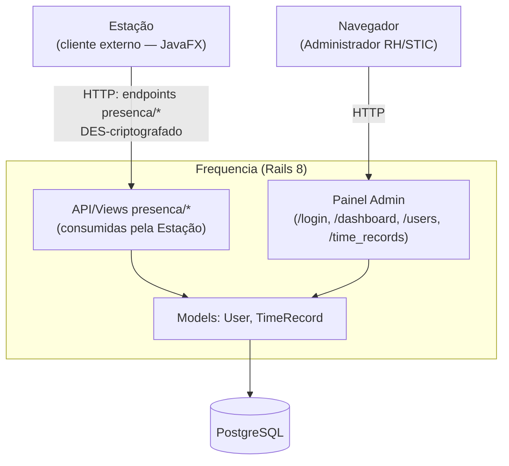
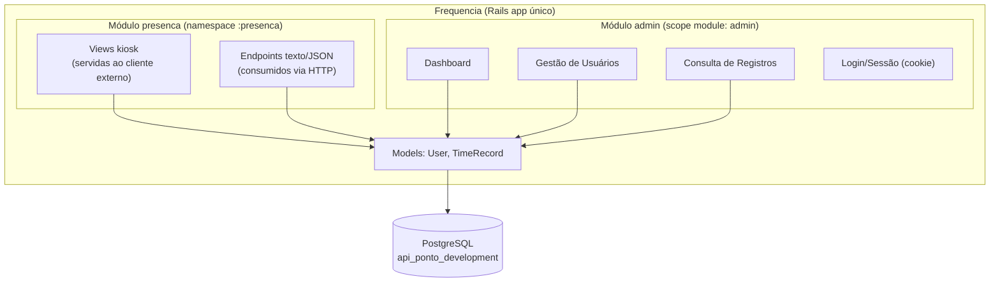
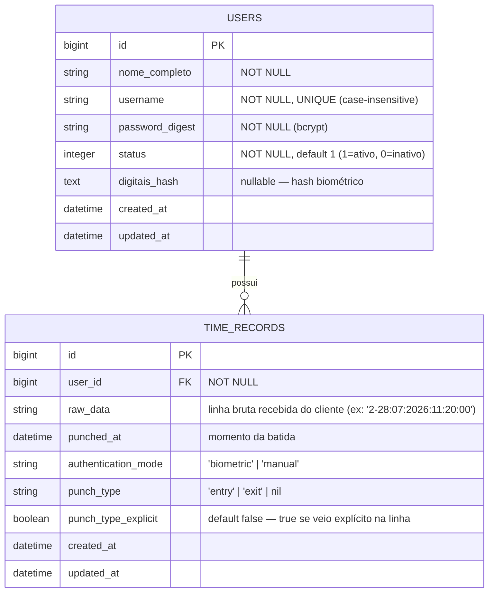
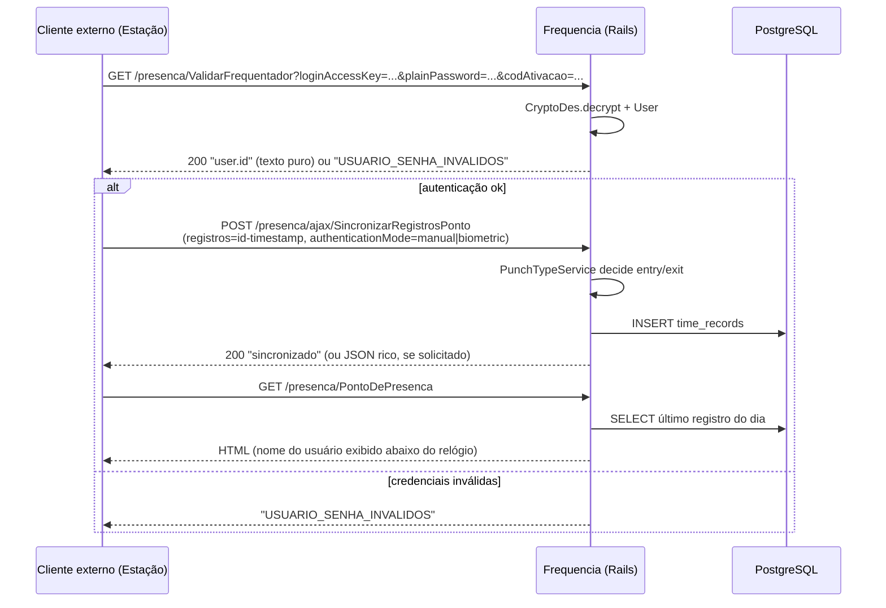
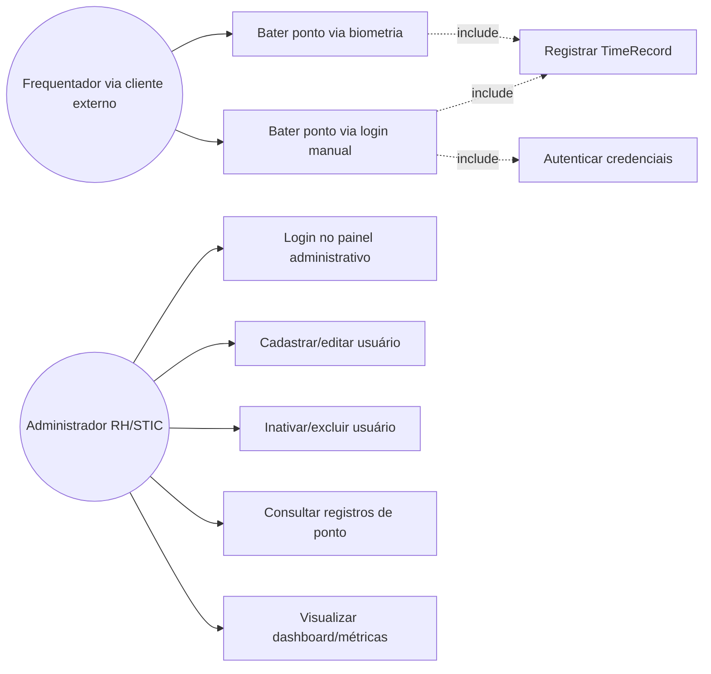
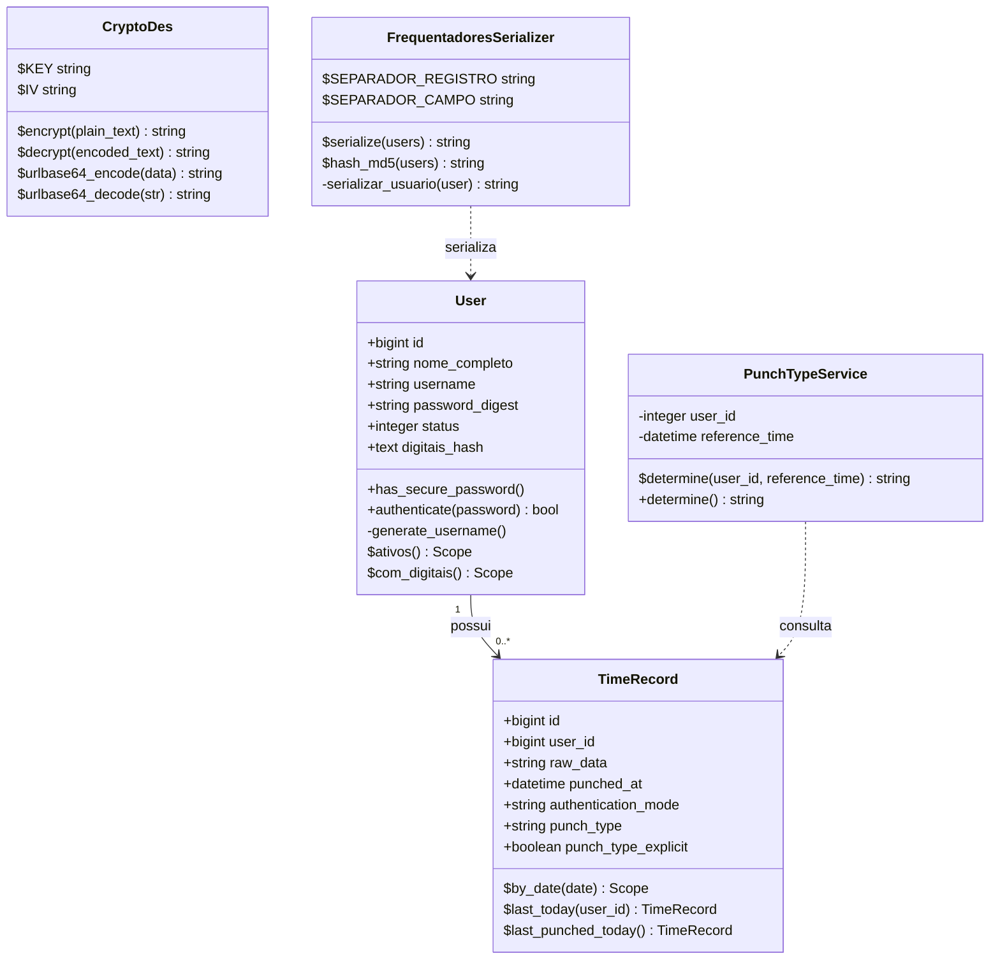

# Documentação Técnica Completa — Frequencia (api-ponto)

> **Escopo:** o backend **Frequencia/api-ponto** (Rails 8), responsável pela API de ponto/frequência e pelo painel administrativo do TJPI. A **Estação** (cliente desktop JavaFX) é tratada aqui apenas como **consumidor externo** da API — seu código-fonte, arquitetura interna e regras de negócio não fazem parte deste documento.
> **Referência arquitetural:** ADR-001 — *Estação e Frequencia são Componentes Cooperantes*
> (`Estacao/docs/governance/adr/adr-001-estacao-frequencia-cooperantes.md`).
> **Contexto:** PoC substituindo o antigo "Módulo Presença" (Java/Tomcat) da Intranet do TJPI.

---

## Sumário

1. [Visão Geral](#1-visão-geral)
2. [Arquitetura](#2-arquitetura)
3. [Rotas](#3-rotas)
4. [Modelagem de Banco](#4-modelagem-de-banco)
5. [Serviços de Domínio](#5-serviços-de-domínio)
6. [Features](#6-features)
7. [Integração com a Estação (cliente externo)](#7-integração-com-a-estação-cliente-externo)
8. [Segurança](#8-segurança)
9. [Casos de Uso](#9-casos-de-uso)
10. [Regras de Negócio Detalhadas](#10-regras-de-negócio-detalhadas)
11. [Diagrama de Classes](#11-diagrama-de-classes)
12. [Pontos em Aberto](#12-pontos-em-aberto)
13. [Extensões Futuras Possíveis](#13-extensões-futuras-possíveis)
14. [Comparativo — Backend Legado vs. Frequencia](#14-comparativo--backend-legado-vs-frequencia)
15. [Referências](#15-referências)

---

## 1. Visão Geral

A **Frequencia** (`Frequencia/api-ponto`) é uma aplicação **Rails 8** que concentra toda a lógica de servidor do sistema de controle de ponto do TJPI:

- **Papel da Frequencia**: serve (a) páginas HTML e endpoints texto/JSON no namespace `presenca`, consumidos pela Estação, e (b) um painel administrativo (`/dashboard`, `/users`, `/time_records`) para RH/STIC gerenciarem cadastros e auditar batidas.
- **Banco de dados canônico**: o schema Postgres da Frequencia é a única fonte de verdade do sistema — não há duplicação de dados fora dela.
- **Estação como cliente**: a Frequencia não assume nada sobre a implementação da Estação além do contrato HTTP que ela expõe em `presenca/*` (ver §7).

### 1.1 Stack tecnológica

| Camada | Tecnologia |
|---|---|
| Backend | Ruby on Rails 8 (API + views), PostgreSQL |
| Autenticação | `has_secure_password` (bcrypt), sessão de cookie (painel admin) |
| Frontend (kiosk, servido ao cliente externo) | HTML/CSS/JS puro (sem framework) |
| Frontend (admin) | Bootstrap 5 (via CDN) |

---

## 2. Arquitetura

Aplicação Rails 8 com **dois módulos dentro do mesmo app** (ADR-001, Seção 4):

O módulo `presenca` é desenhado para preservar, no nome das rotas e no formato de dados, o contrato herdado do sistema legado (ver §14) — isso garante compatibilidade com o cliente externo sem exigir mudanças nele.

---

## 3. Rotas

### 3.1 Módulo `presenca` (consumido pelo cliente externo)

| Verbo | Rota | Controller#Action | Observação |
|---|---|---|---|
| GET | `/presenca/IniciarPonto` | `iniciar_ponto#show` | Primeira página carregada pelo cliente |
| GET | `/presenca/InicializarPonto` | `inicializar_ponto#show` | Redirect automático (JS) |
| GET | `/presenca/PontoDePresenca` | `ponto_de_presenca#show` | Tela final onde o cliente fica parado |
| GET | `/presenca/ValidarFrequentador` | `validar_frequentador#show` | Autenticação (DES) |
| GET | `/presenca/DynFrequentadoresEstacao` | `dyn_frequentadores_estacao#index` | Lista de frequentadores (biometria) |
| GET | `/presenca/DynHashFrequentadoresEstacao` | `dyn_hash_frequentadores_estacao#show` | Hash p/ detectar mudanças |
| GET | `/presenca/CarregaRelogioAtual` | `carrega_relogio_atual#show` | Checagem de conectividade |
| POST | `/presenca/ajax/SincronizarRegistrosPonto` | `sincronizar_registros_ponto#create` | Grava `TimeRecord` |
| GET | `/presenca/Frequentador` | `frequentador#show` | Tela de cadastro de digital (stub) |
| GET | `/presenca/AdicioneEstacao` | `adicione_estacao#show` | Stub — `render plain: "OK"` |
| GET | `/presenca/ProblemaRegistro` | `problema_registro#show` | Stub — `render plain: "OK"` |

### 3.2 Módulo `admin` (painel web, autenticado por sessão)

| Verbo | Rota | Controller#Action |
|---|---|---|
| GET/POST | `/login` | `sessions#new` / `sessions#create` |
| DELETE | `/logout` | `sessions#destroy` |
| GET | `/dashboard` (raiz `/`) | `dashboard#index` |
| GET/POST/PATCH/DELETE | `/users`, `/users/:id`, `/users/new`, `/users/:id/edit` | `users#*` |
| DELETE | `/users/:id/purge` | `users#purge` |
| GET | `/time_records` | `time_records#index` |

---

## 4. Modelagem de Banco

**Índices:** `users.username` (único), `users.status`, `time_records.user_id`, `time_records.punched_at`.

**Regras de negócio no schema** (detalhadas em §10):
- `User#password` — mínimo 6 caracteres (via `has_secure_password` + validação customizada).
- `User#username` — gerado automaticamente a partir de `nome_completo` se não informado.
- `TimeRecord#authentication_mode` — restrito a `biometric`/`manual` (`inclusion`).
- `TimeRecord#punch_type` — restrito a `entry`/`exit`/nulo.
- Exclusão de usuário (`purge`) só é permitida se **inativo** e **sem `TimeRecord` vinculado** (proteção via `restrict_with_exception` na associação).

---

## 5. Serviços de Domínio (`app/services/`)

| Serviço | Responsabilidade |
|---|---|
| `CryptoDes` | Criptografia DES-CBC + UrlBase64, usada na troca de credenciais com `ValidarFrequentador` |
| `FrequentadoresSerializer` | Serializa usuários no formato legado (`id;matricula;nome;digital;foto;isAdmin;sexo;localTrabalho`) esperado pelo cliente externo |
| `PunchTypeService` | Decide se a próxima batida de um usuário é `entry` ou `exit`, alternando com base na última batida do dia |

---

## 6. Features

| Feature | Descrição |
|---|---|
| **Autenticação de ponto (DES)** | `ValidarFrequentador` decripta usuário/senha, autentica via bcrypt |
| **Sincronização de batidas** | `SincronizarRegistrosPonto` recebe lote de registros (`user_id-timestamp[-tipo]`), cria `TimeRecord`s em transação, decide `punch_type` automaticamente se não vier explícito |
| **Resposta rica opcional** | `SincronizarRegistrosPonto` responde texto simples (`"sincronizado"`, compat. legado) ou JSON detalhado (`nome`, `foto`, `horario`, `punch_type`) via `Accept: application/json` ou `confirmacaoVisual=1` |
| **Download de frequentadores** | `DynFrequentadoresEstacao`/`DynHashFrequentadoresEstacao` alimentam o cadastro de biometria consumido externamente (só usuários com `digitais_hash`) |
| **Tela kiosk** | `PontoDePresenca` — tela servida ao cliente com relógio, mensagem de status, formulário de login manual e sincronização automática |
| **Dashboard administrativo** | Métricas (usuários ativos/inativos, com digitais, batidas hoje/semana/mês) + "Últimas Batidas" (entradas/saídas em colunas separadas) |
| **CRUD de usuários** | Criar/editar/inativar/excluir usuários, com proteções (não excluir usuário com histórico) |
| **Consulta de registros** | Filtro por usuário, id e intervalo de datas (`/time_records`) |

---

## 7. Integração com a Estação (cliente externo)

A Estação é um cliente desktop externo que consome o contrato HTTP do módulo `presenca`. Do ponto de vista da Frequencia, o fluxo relevante é:

### 7.1 Contrato de dados legado exposto pela Frequencia

Vários formatos de string na API `presenca/*` **preservam o contrato do sistema Java/Tomcat original** (ver `amostra_intranet.sql`), por compatibilidade com o cliente externo:

- `registros`: `"<user_id>-<dd:MM:yyyy:HH:mm:ss>[-<punch_type>]"`
- `codAtivacao`: whitelist fixa em modo PoC (`poc-ativacao-001`, `SistemaOperacionalNaoSuportado`)
- Horário do servidor propagado como `"DiaSemana,Dia,MêsExtenso,Ano,HH:MM"` (formato legado, consumido pelo cliente externo)

---

## 8. Segurança

| Mecanismo | Onde | Observação |
|---|---|---|
| **bcrypt** (`has_secure_password`) | Senha de usuário | Padrão robusto, hash unidirecional |
| **DES-CBC + UrlBase64** | Transporte usuário/senha com o cliente externo | Chave fixa (`"cryp:gpf"`) hardcoded no código-fonte — **não é um limite de segurança real** (qualquer um com acesso ao código pode cifrar/decifrar); funciona apenas como ofuscação/compatibilidade de contrato legado, não como controle de acesso |
| **Sessão de cookie** | Painel admin | `session[:user_id]`, `require_login` no `Admin::ApplicationController` |
| **CSRF** | Rails | `verify_authenticity_token` padrão, exceto `Admin::SessionsController#create` (explicitamente `skip_before_action`) |
| **`codAtivacao` whitelist** | Endpoints `presenca/*` | Única barreira de "autenticação de estação" hoje — fixa/estática, modo PoC |

**⚠️ Achado de segurança relevante:** a chave DES fixa e pública no código-fonte permite que qualquer pessoa com acesso ao repositório monte requisições válidas para `ValidarFrequentador`/`SincronizarRegistrosPonto` diretamente via `curl`, sem precisar do cliente físico — confirmado empiricamente durante o desenvolvimento. Isso é aceitável para uma **PoC em rede interna controlada**, mas deve ser revisto antes de qualquer exposição além da intranet.

---

## 9. Casos de Uso

| Caso de Uso | Ator | Pré-condição | Fluxo principal (na Frequencia) | Pós-condição |
|---|---|---|---|---|
| **Bater ponto via biometria** | Frequentador (via cliente externo) | Usuário ativo com `digitais_hash` cadastrado | `POST SincronizarRegistrosPonto` (`authenticationMode=biometric`) → `TimeRecord` criado | Ponto registrado |
| **Bater ponto via login manual** | Frequentador (via cliente externo) | Usuário/senha válidos | `GET ValidarFrequentador` → autentica → `POST SincronizarRegistrosPonto` (`authenticationMode=manual`) | Ponto registrado (`authentication_mode: manual`) |
| **Login no painel administrativo** | Administrador | Usuário ativo cadastrado | `/login` → usuário/senha → sessão criada | Acesso a `/dashboard` |
| **Cadastrar/editar usuário** | Administrador | Sessão ativa | `/users/new` ou `/users/:id/edit` → salva | `User` criado/atualizado |
| **Inativar/excluir usuário** | Administrador | Sessão ativa | `/users/:id` DELETE (inativa) ou `/purge` (exclui, se sem histórico) | `status: 0` ou registro removido |
| **Consultar registros de ponto** | Administrador | Sessão ativa | `/time_records` com filtros (usuário, data) | Lista filtrada exibida |
| **Visualizar dashboard** | Administrador | Sessão ativa | `/dashboard` | Métricas + últimas batidas (entrada/saída lado a lado) |

---

## 10. Regras de Negócio Detalhadas

> Levantamento exaustivo das regras de negócio **efetivamente implementadas no código atual da Frequencia**, com evidência de arquivo e linha. Regras do sistema legado (Intranet/Tomcat) e regras internas da Estação (cliente externo) **não** estão aqui — ver §14 (Comparativo) para o legado.

### 10.1 Autenticação

| # | Regra |
|---|---|
| RN-A01 | Login manual só autentica usuário **ativo**, com senha correta e `codAtivacao` dentro da whitelist (`poc-ativacao-001`, `SistemaOperacionalNaoSuportado`) — `Frequencia/api-ponto/app/controllers/presenca/validar_frequentador_controller.rb:4-17`. |
| RN-A02 | Qualquer exceção durante a validação retorna sempre `"USUARIO_SENHA_INVALIDOS"` — nunca vaza erro interno ao cliente — `.../validar_frequentador_controller.rb:18-19`. |
| RN-A03 | Login administrativo (painel web) exige senha correta **e** `status == 1` (ativo) — `Frequencia/api-ponto/app/controllers/admin/sessions_controller.rb:16`. |
| RN-A04 | Todas as rotas administrativas exigem sessão logada, exceto a própria tela de login (`new`/`create`) — `admin/application_controller.rb:10,24-28` + `admin/sessions_controller.rb:3`. |
| RN-A05 | A criação de sessão administrativa é isenta de proteção CSRF — `admin/sessions_controller.rb:4`. |
| RN-A06 | As rotas do módulo `presenca/*` (consumidas pelo cliente externo) não exigem sessão administrativa — `presenca/application_controller.rb:2-7`. |

### 10.2 Usuários

| # | Regra |
|---|---|
| RN-U01 | Nome completo (`nome_completo`) é obrigatório — `app/models/user.rb:8`. |
| RN-U02 | `username` é obrigatório e único, case-insensitive — `user.rb:9`; reforçado por índice único no banco (`db/schema.rb:33`). |
| RN-U03 | `status` é obrigatório — `user.rb:10`; coluna `NOT NULL`, default `1` (ativo) — `db/schema.rb:30`. |
| RN-U04 | Senha exige mínimo de 6 caracteres, na criação ou sempre que for alterada — `user.rb:11`. |
| RN-U05 | `username` é gerado automaticamente a partir do nome completo quando não informado (transliteração, minúsculas, `primeiro.ultimo`, sufixo numérico em colisão) — `user.rb:6,18-41`. |
| RN-U06 | Usuário "ativo" = `status == 1` (`scope :ativos`) — `user.rb:13`. |
| RN-U07 | Usuário "com digitais" = `digitais_hash` não nulo (`scope :com_digitais`) — `user.rb:14`. |
| RN-U08 | Exclusão via painel ("destroy") **não apaga** o registro — apenas inativa (`status: 0`, soft delete) — `admin/users_controller.rb:33-36`. |
| RN-U09 | Exclusão física ("purge") só é permitida se o usuário estiver **inativo** e **sem** `time_records` vinculados — `admin/users_controller.rb:38-47`. |
| RN-U10 | Editar cadastro sem preencher senha não altera a senha existente (campo removido dos parâmetros permitidos) — `admin/users_controller.rb:55-60`. |
| RN-U11 | Um usuário não pode ser destruído via ORM (hard delete direto) enquanto tiver `time_records` associados — `user.rb:4` (`dependent: :restrict_with_exception`). |

### 10.3 Registros de Ponto (Time Records)

| # | Regra |
|---|---|
| RN-R01 | Todo registro exige `raw_data` e `punched_at` — `app/models/time_record.rb:4-5`. |
| RN-R02 | `authentication_mode` é obrigatório e restrito a `"biometric"`/`"manual"` — `time_record.rb:6`. |
| RN-R03 | `punch_type`, quando presente, só pode ser `"entry"`/`"exit"` (nulo permitido) — `time_record.rb:7`. |
| RN-R04 | Determinação automática de entrada/saída: sem registro no dia ou último foi `"exit"` → próximo é `"entry"`; caso contrário, `"exit"` — `app/services/punch_type_service.rb:11-16`. |
| RN-R05 | Sincronização só é aceita se `codAtivacao` estiver na whitelist; caso contrário responde `"sincronizado"` sem persistir nada (compatibilidade silenciosa) — `presenca/sincronizar_registros_ponto_controller.rb:9-11`. |
| RN-R06 | Cada linha do lote deve casar com o formato `"<user_id>-<dd:MM:yyyy:HH:mm:ss>[-<tipo>]"`; linhas fora do formato são rejeitadas individualmente, sem abortar o lote — `.../sincronizar_registros_ponto_controller.rb:28-32`. |
| RN-R07 | O `user_id` referenciado deve existir; senão a linha é rejeitada com motivo específico — `.../sincronizar_registros_ponto_controller.rb:43-50`. |
| RN-R08 | Se `punch_type` vier explícito e válido na linha, prevalece sobre o cálculo automático; caso ausente/inválido, usa `PunchTypeService` como fallback — `.../sincronizar_registros_ponto_controller.rb:52-65`. |
| RN-R09 | Cada registro grava `punch_type_explicit` (auditoria: veio do payload vs. foi inferido) — `.../sincronizar_registros_ponto_controller.rb:73-76`; coluna `NOT NULL`, default `false` (`db/schema.rb:23`). |
| RN-R10 | Todo o lote é processado em transação — falha em qualquer linha reverte o lote inteiro — `.../sincronizar_registros_ponto_controller.rb:20-24,86`. |
| RN-R11 | `authenticationMode` só é gravado como `"manual"` se o parâmetro recebido for exatamente esse valor; qualquer outro é gravado como `"biometric"` — `.../sincronizar_registros_ponto_controller.rb:71`. |
| RN-R12 | Resposta em JSON detalhado só ocorre com `Accept: application/json` ou `confirmacaoVisual=1`; sem isso, resposta é sempre texto puro `"sincronizado"`, mesmo havendo linhas rejeitadas — `.../sincronizar_registros_ponto_controller.rb:91-112,135-137`. |
| RN-R13 | Erro genérico no lote também retorna `"sincronizado"` em texto puro quando o formato rico não foi solicitado — `.../sincronizar_registros_ponto_controller.rb:113-123`. |
| RN-R14 | O parâmetro `registros` é tratado como potencialmente cifrado (DES); se a decriptação falhar, usa o valor bruto como fallback — `.../sincronizar_registros_ponto_controller.rb:152-160`. |
| RN-R15 | `TimeRecord.last_today` retorna a última batida do usuário no dia, desempatando por `created_at` — `time_record.rb:10-14`. |
| RN-R16 | `TimeRecord.last_punched_today` retorna a última batida do dia entre **todos** os usuários (usada para status de tela) — `time_record.rb:16-22`. |
| RN-R17 | Todo `time_record` deve pertencer a um `user` existente (FK obrigatória) — `db/schema.rb:14,37`. |

### 10.4 Sincronização de Frequentadores / Biometria (lado servidor)

| # | Regra |
|---|---|
| RN-F01 | Só usuários ativos **e** com digitais cadastradas são enviados ao cliente externo — `presenca/dyn_frequentadores_estacao_controller.rb:4`, `dyn_hash_frequentadores_estacao_controller.rb:4` (`User.ativos.com_digitais`). |
| RN-F02 | Serialização usa formato posicional fixo separado por `;` (id, username, nome, digitais_hash, "", "false", "N", "0"), registros separados por `'` — `app/services/frequentadores_serializer.rb:2-24`. |
| RN-F03 | Hash de verificação de mudança nas digitais é MD5 (uppercase) do payload serializado — usado pelo cliente externo para decidir se precisa rebaixar o cadastro local — `frequentadores_serializer.rb:9-11`. |
| RN-F04 | Criptografia de credenciais/registros usa DES-CBC com chave/IV fixos `"cryp:gpf"`, em Base64 URL-safe sem padding — `app/services/crypto_des.rb:2-3,23-37`. |

### 10.5 Dashboard e Consultas Administrativas

| # | Regra |
|---|---|
| RN-D01 | Contadores "hoje/semana/mês" usam janelas fixas relativas a `Time.current`: início do dia, 7 dias atrás, 30 dias atrás — `admin/dashboard_controller.rb:9-12`. |
| RN-D02 | Listagem de registros de ponto no admin é paginada em blocos fixos de 50 — `admin/time_records_controller.rb:3,27`. |

### 10.6 Observação sobre lacunas conscientes

Os controllers `presenca/adicione_estacao_controller.rb`, `problema_registro_controller.rb`, `carrega_relogio_atual_controller.rb`, `frequentador_controller.rb` e `inicializar_ponto_controller.rb` não contêm lógica condicional própria — são apenas endpoints de eco/relógio/heartbeat (stubs), sem regra de negócio adicional.

---

## 11. Diagrama de Classes

---

## 12. Pontos em Aberto

Levantamento consolidado de tudo que foi identificado como incompleto, divergente ou pendente na Frequencia — **nenhum destes itens foi resolvido**, ficam registrados para priorização futura.

### 12.1 Funcionalidades do sistema legado não portadas

| Item | Descrição | Evidência |
|---|---|---|
| **`PrediosPermitidos`** | Endpoint que o cliente externo chama para saber a quais prédios ele está associado — **não existe rota na Frequencia** (404 confirmado em log real) | `amostra_intranet.sql`: tabelas `presenca_estacao_predio`/`presenca_frequentador_predio` |
| **`permitirManual`** | No sistema original, cada frequentador tem uma flag própria autorizando (ou não) login manual — hoje **qualquer usuário ativo pode logar manualmente** na Frequencia, sem essa checagem | `presenca_frequentador.permitirManual` (bit) |
| **`liberadoBatidaManual`** | Flag *por estação* (não por usuário) autorizando login manual — a Frequencia nunca implementa essa checagem | `presenca_estacaoponto.liberadoBatidaManual` |
| **Vocabulário `modo`/`operacao`** | Sistema original usa `'BIOMETRICO'`/`'ENTRADA'`/`'SAIDA'` (maiúsculo, PT); a Frequencia usa `'biometric'`/`'entry'`/`'exit'` (inglês) — divergência de nomenclatura, quebra compatibilidade 1:1 com dados históricos caso um dia sejam migrados | Comparação direta dos dumps |

### 12.2 Bugs conhecidos e não corrigidos (fora do escopo tratado)

| Item | Descrição | Localização |
|---|---|---|
| **Comentário desatualizado sobre AdminLTE** | `Admin::ApplicationController` documenta o layout `"admin"` como "AdminLTE do fork, adaptado em R.2", mas `admin.html.erb` real usa só Bootstrap puro, sem nenhum vestígio de AdminLTE | `app/controllers/admin/application_controller.rb:4` |
| **`document.querySelectorAll(...).forEach` no layout `application.html.erb`** | Ainda quebra silenciosamente no WebKit antigo do cliente externo (mesma classe de bug já corrigida na página `kiosk`) — afeta as páginas `IniciarPonto`/`InicializarPonto`, que ainda usam o layout AdminLTE | `app/views/layouts/application.html.erb` |
| **Diagnóstico `JSERROR` ainda ativo** | `window.onerror` foi adicionado como instrumentação temporária de debug e nunca foi removido | `app/views/layouts/application.html.erb` |

### 12.3 Débito de infraestrutura/repositório

| Item | Descrição |
|---|---|
| **Chave SSH exposta** | Arquivos `davi`/`davi.pub` (par de chave OpenSSH privada/pública) soltos na raiz do repositório `Frequencia/api-ponto`, não commitados mas presentes no diretório de trabalho |
| **`test/adversarial/`** | Suíte de testes legada e não rastreada pelo git, com asserções desatualizadas em relação ao estado atual da view `ponto_de_presenca` |
| **Log/cache versionados na Frequencia** | `log/development.log`, `log/test.log`, `tmp/cache/bootsnap/*` aparecem como modificados no `git status` — deveriam estar no `.gitignore` |

### 12.4 Cobertura de testes

- A suíte principal (117 testes Rails ao final desta sessão) cobre bem os controllers `presenca/*` e `admin/*` recém-alterados.
- `test/adversarial/login_manual_adversarial_test.rb` — não rastreado, parcialmente desatualizado, precisa de decisão: atualizar ou aposentar.

---

## 13. Extensões Futuras Possíveis

Organizadas por impacto/esforço estimado, com base no que já foi mapeado (dump legado, arquitetura atual, e lacunas identificadas):

### 13.1 Curto prazo (baixo esforço, alto valor)

- **Implementar `PrediosPermitidos`**: criar model `Predio` + tabela de associação `users_predios` (ou similar), endpoint `GET /presenca/PrediosPermitidos` retornando os prédios da estação corrente.
- **Checagem de `permitirManual`/`liberadoBatidaManual`**: adicionar os dois booleanos (um em `User`, outro numa futura entidade `Estacao`) e validar em `ValidarFrequentadorController` antes de autenticar — devolvendo os erros que o cliente externo **já sabe tratar** (`USUARIO_SEM_PERMISSAO_MANUAL`, `ESTACAO_SEM_PERMISSAO_PARA_BATIDA_MANUAL`), sem precisar mexer no cliente.
- **Remover a instrumentação `JSERROR`/`window.onerror`** depois de confirmar estabilidade em produção, ou convertê-la num logger permanente e discreto (ex: só grava se `Rails.env.development?`).

### 13.2 Médio prazo

- **Painel de auditoria de sincronização**: visão administrativa mostrando batidas pendentes/atrasadas do lado do cliente externo (via heartbeat).
- **Múltiplas estações com gestão centralizada**: modelar `Estacao` como entidade própria na Frequencia (hoje só existe implicitamente via `codigoAtivacao`), com painel admin para cadastrar/desativar estações, visualizar status/última atividade.
- **Relatórios de frequência mensal**: `presenca_relatoriofrequenciafinal`/`presenca_registromensalfrequencia` do sistema legado sugerem a necessidade natural de fechamento mensal de frequência, banco de horas etc. — hoje a Frequencia só tem o registro bruto de batidas, sem nenhum cálculo agregado.

### 13.3 Longo prazo / arquitetural

- **Endurecer a segurança do transporte com o cliente externo**: substituir a chave DES fixa hardcoded por um segredo por-estação (derivado do `codigoAtivacao`, rotacionável), ou migrar para HTTPS mútuo/mTLS caso a rede deixe de ser 100% interna/confiável.
- **Registro de "ressalva"** (`ressalva`/`zona` no schema legado): o conceito de leitura biométrica fora do prédio esperado/horário normal existe no schema legado, mas não tem contraparte na Frequencia atual — se essa regra de negócio for necessária, precisa ser desenhada do zero.
- **Migração de dados históricos**: caso decida-se migrar batidas reais do sistema legado (`presenca_registrofrequencia`) pra Frequencia, será necessário um pipeline de ETL dedicado — dado que o schema, vocabulário e modelo de usuário são estruturalmente diferentes (ver §12.1), **não é um `INSERT` direto**.

---

## 14. Comparativo — Backend Legado vs. Frequencia

> Base: `amostra_intranet.sql` (schema real do módulo `presenca_*` da Intranet TJPI) contra o estado atual da Frequencia descrito nas seções 1–13 deste documento.

### 14.1 Visão geral da mudança

| | **Backend Legado** | **Frequencia (atual)** |
|---|---|---|
| Plataforma | Módulo "Presença" dentro da **Intranet do TJPI** (Java/Tomcat, JSPs) — um monólito com dezenas de outros módulos (`aproc_*`, `concursos_*`, `ferias_*`, `contrato_*`, etc.) | **Frequencia/api-ponto**, aplicação **Rails 8 dedicada**, isolada do restante da Intranet |
| Frontend servido ao cliente externo | Páginas **JSP** (`IniciarPonto.jsp`, etc.) | Views **Rails/ERB** no namespace `presenca` — mesmas rotas/nomes preservados por compatibilidade |
| Painel administrativo | Parte do painel geral da Intranet (`admin_*`, RBAC completo: `admin_profile`, `admin_role`, `admin_module`) | Painel próprio e simplificado (`Admin::` namespace) com sessão de cookie única, sem RBAC granular |
| Escopo do projeto | Um módulo entre muitos de um sistema corporativo amplo | **PoC dedicada**, escopo restrito a ponto/frequência |

### 14.2 Arquitetura

- **Legado**: acoplado à Intranet monolítica — o módulo Presença dependia de entidades de outros domínios (`sistema_usuario`, `global_orgao`, `global_predio`, `tjpi_vinculo`, `tjpi_vinculado`, `aproc_manifestacao`) para funcionar. Regras de negócio (cálculo de frequência, banco de horas, direitos, regimes de trabalho) viviam no mesmo banco.
- **Frequencia**: componente desacoplado via HTTP (ADR-001) — não depende de nenhuma outra tabela/serviço da Intranet; é auto-contida (`User`, `TimeRecord`). Ganha independência de deploy e de modelo de dados, mas **perde** todo o cálculo de frequência/banco de horas que existia no legado (ver §14.4).

### 14.3 Features — o que mudou

| Feature | Legado (Intranet) | Frequencia (atual) |
|---|---|---|
| Autenticação de ponto (login manual) | DES + validação de `permitirManual` (flag por frequentador) e `liberadoBatidaManual` (flag por estação) | DES + bcrypt (`has_secure_password`); **sem** as duas flags de permissão — qualquer usuário ativo pode logar manualmente (regressão registrada em §12.1) |
| Prédios permitidos | `presenca_estacao_predio` / `presenca_frequentador_predio` — a estação só aceita frequentadores de prédios autorizados; endpoint `PrediosPermitidos` | **Não implementado** — endpoint não existe, gera 404 real (§12.1, §12.2) |
| Ressalva de prédio | `presenca_registrofrequencia.ressalva`/`zona` — batida fora do prédio esperado é marcada, não bloqueada | Sem equivalente — conceito não portado |
| Cálculo de frequência/banco de horas | `presenca_calculodiario`, `presenca_registromensalfrequencia`, `presenca_relatoriofrequenciafinal`, `presenca_retificadorbancohoras`, `presenca_valorretroativo` — fechamento mensal completo, metas, créditos/débitos, retificação | **Inexistente** — a Frequencia só grava a batida bruta (`TimeRecord`); nenhum agregado é calculado |
| Regimes de trabalho/expediente | `presenca_regime`, `presenca_regimefrequentador` — hash de expediente, modalidade, limites de crédito/débito por regime | Sem equivalente |
| Dias excepcionais/afastamentos | `presenca_diaexcepcional`, `presenca_direito` | Sem equivalente |
| Gestão de estações (cadastro central) | `presenca_estacaoponto` (com `ativo`, `obsAdmin`, `anydesk`/`teamviewer` p/ suporte remoto) + `presenca_estacaoponto_ping` (heartbeat com IP/versão) | Estação identificada apenas por `codAtivacao` **whitelist fixa em código** (`poc-ativacao-001`) — não há tabela/CRUD de estações nem heartbeat persistido |
| Vocabulário de operação | `'BIOMETRICO'` / `'ENTRADA'` / `'SAIDA'` (maiúsculo, PT) | `'biometric'` / `'entry'` / `'exit'` (inglês) — quebra compatibilidade 1:1 com dados históricos |
| Painel administrativo | Robusto, dentro do RBAC geral da Intranet (perfis, papéis, módulos) | Painel próprio simplificado: dashboard de métricas, CRUD de usuários, consulta de registros — sem RBAC granular |
| Segurança do transporte com o cliente externo | Mesma chave DES fixa hardcoded (herdada, nunca foi um controle de acesso real) | Idêntico — achado de segurança já registrado em §8 |

### 14.4 Banco de dados

**Legado** — schema `presenca_*` da Intranet (MySQL/InnoDB), 21 tabelas interligadas ao restante do sistema corporativo:

| Tabela legado | Papel |
|---|---|
| `presenca_frequentador` | Pessoa que bate ponto — ligada a `tjpi_vinculo`/`tjpi_vinculado` (vínculo funcional real), `global_predio` (local de trabalho), flags `permitirManual`, `limitarPrediosPermitidosBaterPonto` |
| `presenca_estacaoponto` | Estação física cadastrada — `codigoAtivacao` único, `liberadoBatidaManual`, suporte remoto (`anydesk`/`teamviewer`), `responsavel_id` |
| `presenca_estacaoponto_ping` | Heartbeat: IP + versão + timestamp por estação |
| `presenca_estacao_predio` / `presenca_frequentador_predio` | N:N — quais prédios cada estação/frequentador pode operar |
| `presenca_registrofrequencia` | Batida individual — `modo`, `operacao`, `ressalva`, `zona`, ligada a `estacaoPonto_id`, `manifestacao_id` (processo administrativo) |
| `presenca_registroestacaoponto` | Lote criptografado recebido da estação antes de virar `registrofrequencia` |
| `presenca_calculodiario` | Fechamento diário: meta, normal, falta, banco de horas, compensação |
| `presenca_registromensalfrequencia` | Fechamento mensal agregado — dias em aberto, faltas, acumulado, saldo líquido |
| `presenca_relatoriofrequenciafinal` / `presenca_relatoriofrequentador` | Relatório final gerado por período |
| `presenca_regime` / `presenca_regimefrequentador` | Expediente/jornada aplicável a cada frequentador |
| `presenca_diaexcepcional`, `presenca_direito`, `presenca_valorretroativo`, `presenca_retificadorbancohoras` | Exceções, direitos, ajustes retroativos e retificações manuais do banco de horas |

**Frequencia (atual)** — schema Rails/PostgreSQL, 2 tabelas autocontidas:

| Tabela atual | Papel |
|---|---|
| `users` | Substitui `presenca_frequentador` **e** parte de `sistema_usuario`/`tjpi_vinculo` — mas sem vínculo funcional real, sem `permitirManual`, sem prédios |
| `time_records` | Substitui `presenca_registrofrequencia` **de forma bem mais simples** — sem `ressalva`, `zona`, `manifestacao_id`; sem ligação com estação (não há FK para uma tabela de estações, pois ela não existe) |

**Diferença estrutural chave**: o legado tratava frequência como um **cálculo contábil** (banco de horas, metas, créditos/débitos, fechamento mensal) integrado a processos administrativos (`aproc_manifestacao`) e vínculos funcionais reais (`tjpi_vinculo`). A Frequencia atual é **apenas um registrador de eventos brutos** (entrada/saída), sem nenhuma camada de cálculo — resolve só a ponta operacional (captura + auditoria simples), não o problema de gestão de frequência como um todo. Isso é consistente com o propósito documentado da PoC, mas é a lacuna mais significativa para uma eventual substituição completa do "Módulo Presença" (ver §13.2 — relatórios de frequência mensal listados como extensão futura).

### 14.5 Segurança — o que mudou e o que não mudou

- **Não mudou**: chave DES fixa hardcoded para o transporte com o cliente externo (herdada 1:1 do legado).
- **Regrediu**: perda das duas checagens de autorização por granularidade fina que existiam no legado (`permitirManual` por pessoa, `liberadoBatidaManual` por estação) — hoje a autenticação manual é all-or-nothing por usuário ativo.
- **Simplificou**: `bcrypt`/`has_secure_password` no lugar do RBAC completo da Intranet (`admin_profile`/`admin_role`) — adequado ao escopo reduzido do painel atual, mas sem equivalente a perfis/papéis diferenciados.

---

## 15. Referências

- `Estacao/docs/governance/adr/adr-001-estacao-frequencia-cooperantes.md` — decisão arquitetural de cooperação entre Estação e Frequencia
- `Estacao/docs/governance/lessons.md` — lições operacionais registradas
- `Frequencia/api-ponto/SPRINT-PLAN.md` — planejamento de sprints do lado Rails
- `Estacao/docs/documentacao-estacao-ponto.md` — documentação do cliente externo (Estação), fora do escopo deste documento
- `amostra_intranet.sql` — amostra do banco de dados do sistema legado original (Intranet TJPI, módulo Presença Java/Tomcat), usada como referência de domínio nesta documentação (não importada para o banco da Frequencia — ver decisão de não fazê-lo por conter dados pessoais reais)

---

*Documento focado exclusivamente no módulo Frequencia (Rails), gerado a partir de leitura de ponta a ponta do repositório `Frequencia/api-ponto` (código-fonte, schema, rotas, testes) e comparação com o sistema legado original.*
