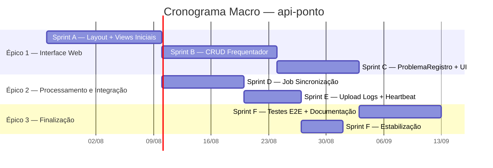

# Implementation Plan — api-ponto
> Versão: 2 | Data: 22/07/2026 | Total de sprints: 9 (Sprints 1-6 + A, B, C, D, E, F)

## Visão Geral

Plano macro de entregas da PoC **api-ponto** — API REST Ruby on Rails 8 que substitui o Módulo Presença
da Intranet TJPI (Java/Tomcat). As Sprints 1-5 já foram concluídas (controllers core, crypto DES, modelos
User e TimeRecord, 25 testes passando). A Sprint 6 está em andamento (validação integração Estação JavaFX).
Este plano cobre as sprints restantes organizadas em 3 épicos: **Interface Web** (views HTML para WebView,
CRUD Frequentador, exibição de entrada/saída), **Processamento e Integração** (job de sincronização,
upload logs, heartbeat) e **Finalização e Estabilização** (testes E2E, documentação, refinamentos).
Total estimado de 6 sprints adicionais (~8 semanas) para completar o MVP.

**Novo na v2:** Funcionalidade de auto-alternação entrada/saída nas batidas de ponto. A cada batida,
o sistema alterna automaticamente entre `entry` e `exit` baseado no último registro do usuário no dia.
As views exibem indicador visual do tipo de batida.

## Diagrama Gantt

## Épicos

### Épico 1 — Interface Web (Screens)
Telas HTML que a Estação Ponto carrega no WebView + layout compartilhado AdminLTE + Bootstrap 5.3.
Agrupa as views de apresentação da API e o CRUD de Frequentadores (UC01).

- **Sprint A:** Layout base, IniciarPonto, InicializarPonto
- **Sprint B:** CRUD Frequentador (list, new, edit, show/explore)
- **Sprint C:** ProblemaRegistro + refinamentos de UI

### Épico 2 — Processamento e Integração
Jobs de backend e funcionalidades complementares de integração com a Estação.

- **Sprint D:** Job de processamento de registros sincronizados (UC12)
- **Sprint E:** Upload de logs (UC08), heartbeat integrado ao ciclo

### Épico 3 — Finalização e Estabilização
Qualidade, testes ponta a ponta, documentação e refinamentos finais.

- **Sprint F:** Testes E2E, refinamento, documentação

## Sprints

### Sprint 1 — Setup (Concluída)
- **Goal:** Inicializar projeto Rails 8 API com PostgreSQL e modelo User.
- **Escopo macro:** Setup Rails 8 API, PostgreSQL, modelo User com `has_secure_password`,
  username auto-gerado (RN01), seed de usuário padrão.
- **Dependências:** Nenhuma
- **Estimativa:** 1 semana
- **RFs cobertos:** RF-02 (Autenticação Manual — base)

### Sprint 2 — Crypto DES + ValidarFrequentador (Concluída)
- **Goal:** Implementar criptografia DES/CBC/PKCS5Padding para compatibilidade com Estação JavaFX.
- **Escopo macro:** Service `CryptoDes` com algoritmo DES/CBC/PKCS5Padding e chave `"cryp:gpf"` (RN03),
  endpoint `ValidarFrequentadorController`, autenticação com bcrypt + DES (RN02).
- **Dependências:** Sprint 1
- **Estimativa:** 1 semana
- **RFs cobertos:** RF-02 (Autenticação Manual)

### Sprint 3 — Relógio, Heartbeat e Hash MD5 (Concluída)
- **Goal:** Implementar endpoints de sincronismo de horário, heartbeat e controle de versão biométrica.
- **Escopo macro:** `CarregaRelogioAtualController` (timestamp servidor — RN07),
  `AdicioneEstacaoController` (heartbeat), `DynHashFrequentadoresEstacaoController` (hash MD5 — RN05).
- **Dependências:** Sprint 2
- **Estimativa:** 1 semana
- **RFs cobertos:** RF-04 (Registro de Batidas — base), RF-05 (Sincronização de Horário)

### Sprint 4 — Disponibilização Biométrica (Concluída)
- **Goal:** Implementar endpoint de download de dados biométricos com serialização legada.
- **Escopo macro:** `DynFrequentadoresEstacaoController`, service `FrequentadoresSerializer`
  (formato `;` + `'`), integração com VIEW `presenca_frequentadorestacao`.
- **Dependências:** Sprint 3
- **Estimativa:** 1 semana
- **RFs cobertos:** RF-03 (Disponibilização de Dados Biométricos)

### Sprint 5 — Sincronização de Registros Offline (Concluída)
- **Goal:** Implementar recebimento e armazenamento de registros de ponto offline.
- **Escopo macro:** `SincronizarRegistrosPontoController`, model `TimeRecord`,
  formatação de registro `<id>-<dd:MM:yyyy:HH:mm:ss>` (RN06), view `ponto_de_presenca/index.html.erb` (stub).
- **Dependências:** Sprint 4
- **Estimativa:** 1 semana
- **RFs cobertos:** RF-04 (Registro de Batidas)

### Sprint 6 — Integração Estação JavaFX (Em andamento)
- **Goal:** Validar integração completa entre Estação JavaFX e API Rails via WebView e curl.
- **Escopo macro:** Testes de integração dos endpoints com a Estação, validação do fluxo
  biometria → login → sincronização → confirmação, `InicializarPontoController`,
  `IniciarPontoController`, `PontoDePresencaController` (sem views HTML completas ainda).
- **Dependências:** Sprint 5
- **Estimativa:** 2 semanas
- **RFs cobertos:** RF-02, RF-03, RF-04, RF-05

---

### Sprint A — Layout Base + Views Iniciais + Auto-Alternação Entrada/Saída
- **Goal:** Estabelecer layout compartilhado com AdminLTE 4 + Bootstrap 5.3, entregar as views
  HTML que a Estação carrega no WebView (IniciarPonto, InicializarPonto) e implementar
  a lógica de auto-alternação entre ponto de entrada e saída.
- **Escopo macro:**
  - Layout compartilhado (application.html.erb) com AdminLTE 4 + Bootstrap 5.3
  - Navbar e sidebar responsivas
  - Migration: campo `punch_type` (string: `entry` | `exit`) no model `TimeRecord`
  - Service `PunchTypeService`: auto-alternação — ao receber batida, verifica último registro
    do usuário no dia; se era `entry` → novo é `exit`, se era `exit` ou não há → novo é `entry`
  - Validação: `SincronizarRegistrosPontoController` chama `PunchTypeService` antes de salvar
  - View `iniciar_ponto` (landing page da Estação com status da última batida)
  - View `inicializar_ponto` (página com JS redirect para PontoDePresenca)
  - Refinamento da view `ponto_de_presenca/index.html.erb`: lista de batidas do dia com
    indicador visual (entrada ✅ / saída ⬆️), status atual do usuário
- **Dependências:** Sprint 6
- **Estimativa:** 2,5 semanas
- **RFs cobertos:** RF-01 (Cadastro — base layout), RF-02 (Autenticação — tela de login),
  RF-04 (Registro de Batidas — auto-alternação entrada/saída)

### Sprint B — CRUD Frequentador (UC01)
- **Goal:** Implementar CRUD completo de Frequentadores com interface web.
- **Escopo macro:**
  - Controller `FrequentadorController` completo (index, new, create, edit, update, show)
  - Views HTML: listagem com tabela AdminLTE, formulários de criação/edição, detalhes
  - Ação de inativar frequentador (toggle status)
  - Validações e RN01 (username único, auto-gerado)
  - Testes de controller e sistema para o CRUD
- **Dependências:** Sprint A (layout)
- **Estimativa:** 2 semanas
- **RFs cobertos:** RF-01 (Cadastro de Usuários — CRUD completo)

### Sprint C — ProblemaRegistro + Refinamentos UI
- **Goal:** Entregar view de reporte de problemas e refinar a interface das telas existentes.
- **Escopo macro:**
  - Controller `ProblemaRegistroController` completo (CRUD ou formulário único)
  - View `problema_registro` (formulário de reporte de problemas na batida)
  - Ajustes de UX nas views existentes (feedback visual, loading states, mensagens)
  - Padronização de componentes (botões, modais, tabelas, formulários)
- **Dependências:** Sprint B (layout e padrões já estabelecidos)
- **Estimativa:** 1,5 semanas
- **RFs cobertos:** RF-01 (extensão), RF-04 (registro de problemas)

### Sprint D — Job de Processamento de Registros Sincronizados (UC12)
- **Goal:** Implementar job assíncrono que processa os registros de ponto recebidos offline.
- **Escopo macro:**
  - Job Rails (ActiveJob + fila padrão) para processamento de `TimeRecord` pendentes
  - Lógica de validação e deduplicação de registros (considerando `punch_type`)
  - Atualização de status dos registros processados
  - Logging e tratamento de falhas
  - Testes do job (unitário e integração)
- **Dependências:** Sprint 6 (sincronização já validada)
- **Estimativa:** 1,5 semanas
- **RFs cobertos:** RF-04 (Registro de Batidas — processamento assíncrono)

### Sprint E — Upload de Logs (UC08) + Heartbeat Integrado
- **Goal:** Implementar upload de logs da Estação e integrar heartbeat no ciclo de vida.
- **Escopo macro:**
  - Endpoint de upload de logs (`UploadFile` — UC08)
  - Model/armazenamento para logs recebidos
  - Integração do heartbeat (`AdicioneEstacao`) no ciclo de comunicação da Estação
  - Tratamento de versão da Estação (UC09 — auto-update, base)
  - Testes dos novos endpoints
- **Dependências:** Sprint D
- **Estimativa:** 1 semana
- **RFs cobertos:** RF-04 (extensão — logs)

### Sprint F — Testes E2E, Refinamento e Documentação
- **Goal:** Finalizar a PoC com testes ponta a ponta, documentação de uso e estabilização.
- **Escopo macro:**
  - Testes E2E simulando fluxo completo da Estação (login → biometria → batida → sincronização → confirmação)
  - Revisão e ajuste de todos os controllers e views
  - Documentação de API (endpoints, formatos, exemplos)
  - Documentação de setup e deploy
  - Relatório final da PoC
  - Correção de bugs levantados durante os testes
- **Dependências:** Sprint C, Sprint E
- **Estimativa:** 2 semanas
- **RFs cobertos:** RF-01 a RF-05 (validação completa)

## Decisões Arquiteturais

| ID | Decisão | Contexto | Consequências |
|----|---------|----------|---------------|
| ADR-01 | Rails 8 modo API + views HTML embutidas | A Estação carrega HTML no WebView; API mode com views evita SPA separado | Views ERB dentro do Rails; sem frontend standalone |
| ADR-02 | DES/CBC/PKCS5Padding para compatibilidade legada | Estação JavaFX usa DES para criptografar payloads | Chave fixa `"cryp:gpf"`; algoritmo fraco mas necessário; nunca usado para senhas (bcrypt) |
| ADR-03 | bcrypt para senhas de usuários | Senhas armazenadas com has_secure_password (bcrypt) | DES só usado no dado transmitido; bcrypt no armazenamento |
| ADR-04 | AdminLTE 4 + Bootstrap 5.3 para interface web | Framework de admin consolidado, compatível com Rails 8 e WebView | Views consistentes; reutilização de componentes |
| ADR-05 | ActiveJob com backend padrão (async) para job de processamento | Sem necessidade de Redis/RabbitMQ para PoC | Jobs não persistem entre restart em dev; ajustável para produção |
| ADR-06 | Username auto-gerado (RN01) | RN exige username único e automático | Lógica no model User; sem exposição em formulário |
| ADR-07 | Código de ativação fixo `"poc-ativacao-001"` (RN04) | PoC não tem fluxo de cadastro de estação | Substituir por fluxo dinâmico em versão pós-PoC |
| ADR-08 | Auto-alternação entrada/saída por sequência diária | Estação não envia tipo de batida; o servidor infere pelo último registro do dia | Lógica no `PunchTypeService`; campo `punch_type` no TimeRecord; ressalva: se usuário bater 2x seguidas sem sair, o sistema registra como alternado |

## Riscos do Projeto

| Risco | Probabilidade | Impacto | Mitigação |
|-------|:------------:|:-------:|-----------|
| **R01 — Compatibilidade DES com Estação real** | Média | Alto | Testar com leitor Nitgen real antes de encerrar Sprint 6 |
| **R02 — Sincronização offline com concorrência** | Média | Médio | Job com deduplicação e locking otimista no TimeRecord |
| **R03 — WebView da Estação não renderizar AdminLTE corretamente** | Baixa | Alto | Testar versão do WebView JavaFX da Estação; fallback para HTML sem JS |
| **R04 — Escopo de upload de logs (UC08) incompleto** | Alta | Baixo | UC08 é complementar; não bloqueia MVP |
| **R05 — Ausência de testes de integração com a Estação real** | Média | Alto | Sprint 6 dedicada à validação; simular via curl se estação não disponível |
| **R06 — Dependência de VIEW SQL `presenca_frequentadorestacao`** | Média | Médio | VIEW pode não existir no banco Rails; replicar como model ou SQL seed |
| **R07 — Auto-alternação falha se estação enviar múltiplas batidas no mesmo segundo** | Baixa | Médio | Garantir unicidade por `user_id + punched_at`; ordernar por `created_at` no `PunchTypeService` |
