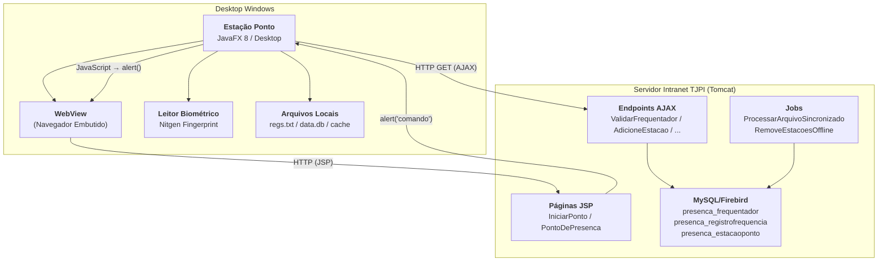
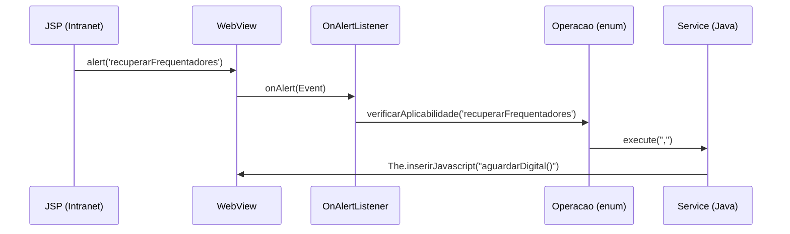
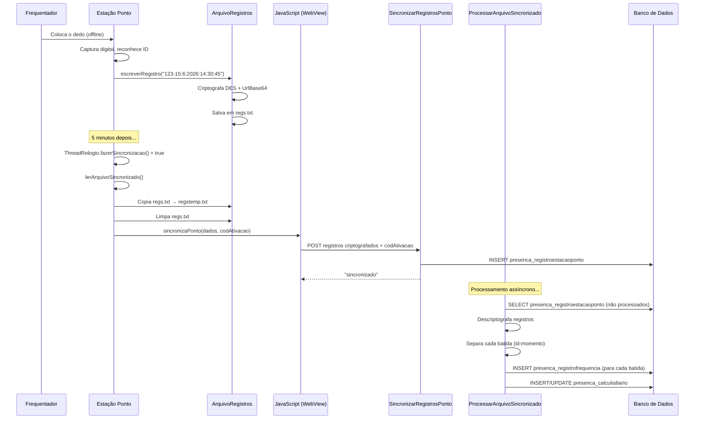
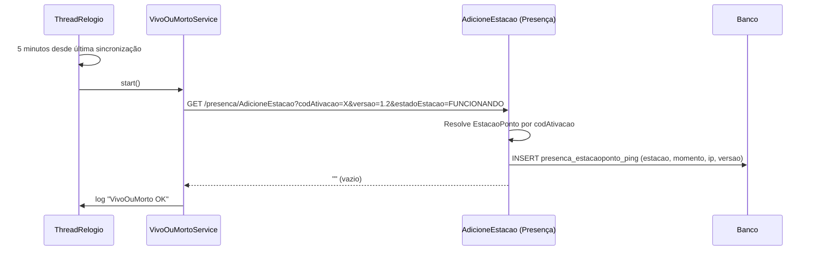
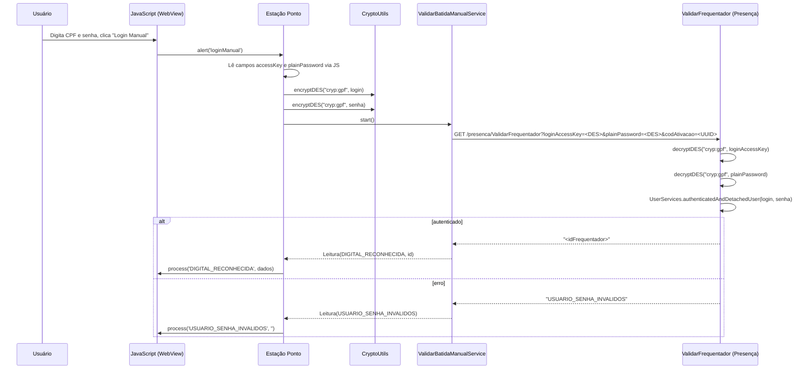
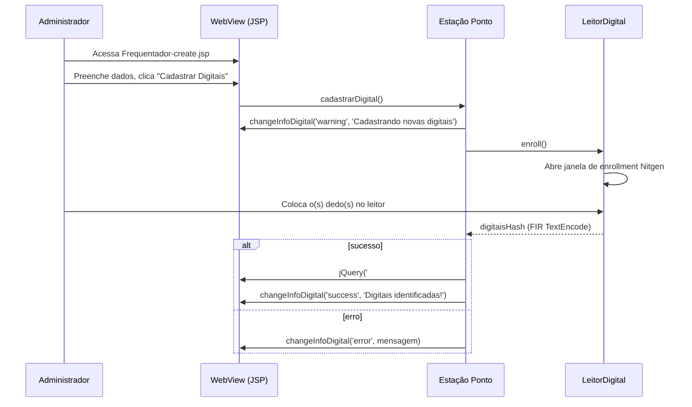
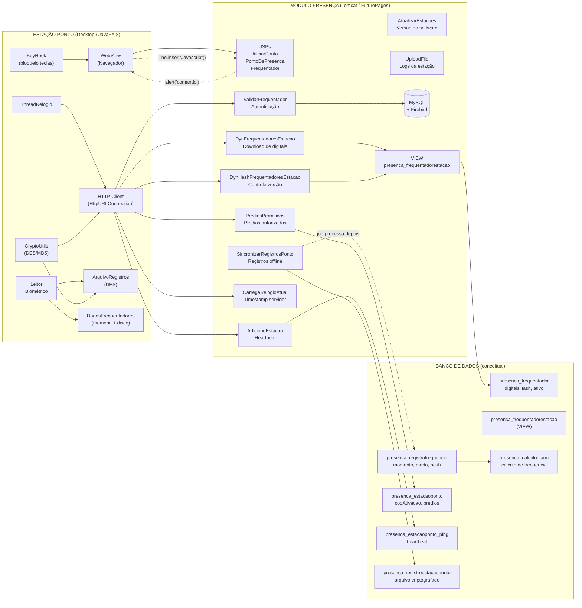

# Relatório de Interação — Módulo Presença × Estação Ponto

> **Versão:** 1.0  
> **Data:** Julho/2026  
> **Objetivo:** Mapear e explicar todos os pontos de integração entre o Módulo Presença (Intranet/Tomcat) e a Estação Ponto (JavaFX Desktop)

---

## Sumário

1. [Visão Geral da Arquitetura](#1-visão-geral-da-arquitetura)
2. [Mecanismos de Integração](#2-mecanismos-de-integração)
3. [Endpoints Consumidos](#3-endpoints-consumidos)
4. [Fluxo de Dados de Frequentadores e Digitais](#4-fluxo-de-dados-de-frequentadores-e-digitais)
5. [Sincronização de Registros Offline](#5-sincronização-de-registros-offline)
6. [Heartbeat (Vivo ou Morto)](#6-heartbeat-vivo-ou-morto)
7. [Login Manual](#7-login-manual)
8. [Cadastro de Digitais](#8-cadastro-de-digitais)
9. [Sincronização de Horário](#9-sincronização-de-horário)
10. [Auto-Update](#10-auto-update)
11. [Upload de Logs](#11-upload-de-logs)
12. [Criptografia Compartilhada](#12-criptografia-compartilhada)
13. [Diagrama Geral de Integração](#13-diagrama-geral-de-integração)

---

## 1. Visão Geral da Arquitetura



### Dois sistemas, um propósito

O **Módulo Presença** (Java Web, Tomcat) é o sistema central que gerencia frequentadores, regimes, cálculos de frequência e relatórios.

A **Estação Ponto** (JavaFX Desktop) é o terminal físico que coleta as batidas de ponto via biometria e as envia para o módulo Presença.

A comunicação entre eles é **unidirecional no sentido da operação**: a Estação consome serviços do Presença. O Presença nunca inicia comunicação com a Estação — ele apenas responde a requisições e processa dados recebidos.

---

## 2. Mecanismos de Integração

A Estação Ponto se conecta ao Módulo Presença por **três mecanismos distintos**:

### 2.1 WebView (Navegador Embutido)

A Estação embute um navegador completo (JavaFX `WebView`) que carrega páginas JSP do Módulo Presença. Isso faz com que a interface de usuário do Presença (HTML/JavaScript) seja renderizada dentro do aplicativo desktop, dando a aparência de um sistema integrado.

**Páginas carregadas:**

| Página | URL em `IntranetURLs.java` | Finalidade |
|--------|---------------------------|------------|
| `IniciarPonto` → `IniciandoPonto.jsp` | `INICIAR_PONTO` | Tela inicial que o usuário vê ao chegar na estação |
| `InicializarPonto` | `INICIALIZAR_PONTO` | Página que recupera código de ativação e redireciona |
| `PontoDePresenca` | `BATIMENTO_PONTO` | Tela principal de batimento (relógio, lista de registros) |
| `Frequentador?type=explore` | (montada em `TelaPonto.java:94`) | Tela de listagem (aberta ao clicar no brasão) |
| `Frequentador?type=create` | `CADASTRO_FREQUENTADOR` | Tela de cadastro de frequentadores |

### 2.2 HTTP GET Direto (AJAX)

A Estação faz requisições HTTP GET diretamente para endpoints específicos do Presença, usando `HttpURLConnection` do Java. Essas chamadas são feitas por serviços assíncronos (`javafx.concurrent.Service`) que rodam em background.

### 2.3 Ponte JavaScript ↔ Java (`alert()` como mecanismo de comando)

Este é o mecanismo mais engenhoso e central da integração. As páginas JSP carregadas no WebView disparam comandos para o Java da Estação através do método `alert()` do JavaScript.

**Como funciona:**



Cada comando reconhecido pelo `listeners/Operacao.java` dispara uma ação específica:

| Comando `alert()` | Ação na Estação | Classe |
|------------------|-----------------|--------|
| `'recuperarFrequentadores'` | Baixa dados de frequentadores e digitais | `DownloadFrequentadoresService` |
| `'horarioServidorAtual:...'` | Inicializa relógio com timestamp do servidor | `ThreadRelogio` |
| `'atualizarRelogioLocal'` | Sincroniza registros offline e envia heartbeat | `MainController.iniciarSincronizacao()` |
| `'limparRegistosBatimentos'` | Limpa o arquivo de registros pendentes | `ArquivoRegistros.limparArquivo()` |
| `'loginManual'` | Inicia fluxo de autenticação por CPF/senha | `ValidarBatidaManualService` |
| `'deadOrAlive'` | Envia heartbeat | `VivoOuMortoService` |

---

## 3. Endpoints Consumidos

A Estação consome **10 endpoints** do Módulo Presença. Segue a especificação de cada um:

### 3.1 ValidarFrequentador

Autentica o frequentador por login/senha criptografado.

```
GET /presenca/ValidarFrequentador
    ?loginAccessKey=<DES("cryp:gpf", login)>
    &plainPassword=<DES("cryp:gpf", senha)>
    &codAtivacao=<codigo-ativacao>
```

| Campo | Valor | Formato |
|-------|-------|---------|
| `loginAccessKey` | Login criptografado | DES/CBC/PKCS5Padding → UrlBase64 |
| `plainPassword` | Senha criptografada | DES/CBC/PKCS5Padding → UrlBase64 |
| `codAtivacao` | Código da estação | UUID (lido do Registro Windows) |

**Resposta sucesso:** `"<id>"` (string com ID numérico do frequentador)
**Resposta erro:** `"USUARIO_SENHA_INVALIDOS"`, `"USUARIO_SEM_PERMISSAO_MANUAL"`, `"ESTACAO_SEM_PERMISSAO_PARA_BATIDA_MANUAL"`

**Estação:** `ValidarBatidaManualService.java:37-38`
**Presença:** `ValidarFrequentador.java` — usa `CryptoUtil.decryptDES("cryp:gpf", ...)` para descriptografar, depois `UserServices.authenticatedAndDetachedUser()` para autenticar

### 3.2 DynFrequentadoresEstacao

Download de todos os frequentadores com suas digitais cadastradas.

```
GET /presenca/DynFrequentadoresEstacao/
```

**Resposta:** String com dados serializados no formato:
```
<id>;<matricula>;<nomeCompleto>;<digitalHash>;<fotoURL>;false;<sexo>;<predioId>'<id>;...'<id>;...;...
```

- **Separador de campos:** `;` (ponto-e-vírgula)
- **Separador de registros:** `'` (apóstrofo)
- O campo `false` indica que nenhum frequentador é administrador (sempre false, mesmo que na VIEW isso possa variar)

**Estação:** `DownloadFrequentadoresService.java:19` (endpoint), `DadosFrequentadores.java:82-98` (parse)
**Presença:** `DynFrequentadoresEstacao.java` → `FrequentadorServices.montarFrequentadoresParaEstacoess()` (linha 302) → consulta a VIEW `presenca_frequentadorestacao`

### 3.3 DynHashFrequentadoresEstacao

Hash MD5 dos dados serializados, usado para controle de versão.

```
GET /presenca/DynHashFrequentadoresEstacao/
```

**Resposta:** String com hash MD5 em hexadecimal (`[A-F0-9]{32}`).

**Estação:** `DownloadFrequentadoresService.java:20` (endpoint), `temNovasDigitais()` (linha 54-74) — compara com hash local
**Presença:** `DynHashFrequentadoresEstacao.java` → `FrequentadorServices.gerarHashFrequentadorEstacao()` (linha 339) — `MessageDigest.getInstance("MD5")`

### 3.4 CarregaRelogioAtual

Timestamp do servidor em milissegundos.

```
GET /presenca/CarregaRelogioAtual
```

**Resposta:** `"<timestamp_ms>"` — string com `Calendar.getInstance().getTimeInMillis()`

**Estação:** `ConexaoIntranetService.java:46` — usado para verificar conectividade e sincronizar `ThreadRelogio`
**Presença:** `CarregaRelogioAtual.java`

### 3.5 PrediosPermitidos

IDs dos prédios onde a estação está autorizada a operar.

```
GET /presenca/PrediosPermitidos/?codAtivacao=<codigo-ativacao>
```

**Resposta:** `"<id1>;<id2>;<id3>"` — IDs separados por ponto-e-vírgula (ex: `"1;3;5"`)

**Estação:** `PrediosPermitidosService.java:17` — resultado armazenado em `MainController.prediosIds`
**Presença:** `PrediosPermitidos.java` — consulta `EstacaoPonto.predios` e concatena os IDs

### 3.6 AdicioneEstacao (Heartbeat)

Sinal periódico informando que a estação está operacional.

```
GET /presenca/AdicioneEstacao
    ?codAtivacao=<URL-encoded>
    &versao=<versao>
    &estadoEstacao=FUNCIONANDO
```

**Resposta:** `""` (string vazia)

**Estação:** `VivoOuMortoService.java:45` — disparado a cada 5 minutos
**Presença:** `AdicioneEstacao.java` — cria `EstacaoPing` com estação, momento, IP e versão, persiste em `presenca_estacaoponto_ping`

### 3.7 SincronizarRegistrosPonto

Envio de registros offline (disparado via JavaScript, não HTTP direto).

```
POST /presenca/ajax/SincronizarRegistrosPonto
```

**Parâmetros:** `registros` (dados criptografados em DES), `codAtivacao`

**Resposta:** ver "Formato de resposta — negociação de conteúdo (Sprint R, Tarefa R.6 e ajuste
pós-R.6)" abaixo. Por padrão, permanece o texto puro `"sincronizado"` (compatibilidade com o
client Java atual); o contrato JSON rico é **opt-in**. Quando `codAtivacao` é ausente/inválido, o
comportamento anterior é preservado: resposta em texto puro `"sincronizado"` (early return, fora
do escopo de R.6), independente do formato solicitado.

**Estação:** chamado via JS `sincronizaPonto(dados, codAtivacao)` em `MainController.iniciarSincronizacao()`
**Presença:** `SincronizarRegistrosPonto.java` — cria `RegistroEstacaoPonto` com os dados brutos + IP + timestamp, salva no banco

#### Campo `punch_type` explícito (compatibilidade retroativa — Sprint R, Tarefa R.4)

O `Presenca::SincronizarRegistrosPontoController` (Rails, `Frequencia/api-ponto`) descriptografa
`registros` e processa cada linha no formato:

```
<user_id>-<dd:mm:yyyy:hh:mm:ss>
```

A partir da Tarefa R.4, cada linha pode opcionalmente trazer um terceiro campo, separado por `-`
ao final, com o tipo de marcação explícito:

```
<user_id>-<dd:mm:yyyy:hh:mm:ss>-<punch_type>
```

Onde `punch_type` é `entry` ou `exit`. Regras de resolução (ADR-001, Seção 3, revisando ADR-08):

- **Se presente e válido** (`entry` ou `exit`): usado diretamente como fonte de verdade. O
  `PunchTypeService.determine` NÃO é chamado para esse registro.
- **Se ausente ou inválido** (ex: linha sem o terceiro campo, valor diferente de `entry`/`exit`,
  string vazia): tratado como ausente, sem gerar erro — cai no fallback existente
  (`PunchTypeService.determine`, que infere o tipo pelo último registro do dia do usuário).

**Estado atual (importante):** a Estação real ainda **não envia** o campo `punch_type` — não há
cadastro biométrico nem máquina em produção usando este campo hoje. Portanto, na prática, 100% dos
registros sincronizados atualmente seguem passando pelo caminho de **fallback** via
`PunchTypeService` (ADR-08), que permanece o comportamento ativo por padrão. O suporte ao campo
explícito é uma extensão de contrato retrocompatível, preparada para quando a Estação/biometria
passar a enviá-lo (ver Tarefas R.5/R.6), e não descontinua nem deprecia o `PunchTypeService`.

Exemplos de linha aceitos:

```
12-15:07:2026:14:30:45            # sem punch_type -> fallback PunchTypeService
12-15:07:2026:14:30:45-entry      # punch_type explícito válido -> usado diretamente
12-15:07:2026:14:30:45-exit       # punch_type explícito válido -> usado diretamente
12-15:07:2026:14:30:45-foo        # valor inválido -> tratado como ausente -> fallback
```

#### Formato de resposta — negociação de conteúdo (Sprint R, Tarefa R.6 e ajuste pós-R.6)

O `user_id` de cada linha é o resultado do matching biométrico já realizado do lado da Estação
(hash MD5 + download de digitais via `DynFrequentadoresEstacaoController`, Sprint 3/4) — este
endpoint **não reimplementa** esse matching, apenas valida que o `user_id` recebido corresponde a
um cadastro existente antes de vincular o `TimeRecord` (ADR-001, Seção 3, passos 3-5).

A lógica de aceite/rejeição de registros roda **sempre da mesma forma**, independente do formato de
resposta — o que muda é apenas a representação de saída, decidida por **content negotiation**:

- **Modo padrão (compatibilidade — nenhuma sinalização explícita do client):** a resposta continua
  sendo o texto puro `"sincronizado"` com status HTTP `200`, exatamente como era antes da Tarefa
  R.6 (desde a Sprint 5). Este é o comportamento que o client Java atual da Estação (fora deste
  repositório) recebe sem precisar de nenhuma mudança — a introdução do JSON rico em R.6 não quebra
  esse client.
- **Modo rico (opt-in — JSON estruturado):** o client sinaliza explicitamente que quer o contrato
  rico de uma das duas formas:
  - enviando o header HTTP `Accept: application/json`; ou
  - enviando o parâmetro de requisição `confirmacaoVisual=1` (convenção de nomenclatura em
    português alinhada aos demais parâmetros do módulo, ex.: `codAtivacao`, `codigoUnicoMaquina`).

  Nesse caso a resposta é **JSON** (Content-Type `application/json`):

```json
{
  "status": "sincronizado",
  "registros_aceitos": [
    {
      "user_id": 12,
      "nome": "Fulano de Tal",
      "foto": { "disponivel": false, "url": null, "motivo": "Foto não cadastrada para o usuário 12" },
      "horario": "15/07/2026 14:30:45"
    }
  ],
  "registros_rejeitados": [
    { "linha": "99999-15:07:2026:14:30:45", "erro": "Usuário não encontrado para o identificador 99999" }
  ]
}
```

Regras (aplicam-se ao modo rico; no modo padrão os registros rejeitados também não geram
`TimeRecord`, mas isso não é reportado ao client — apenas o texto `"sincronizado"`/`200` é
retornado, preservando o comportamento pré-R.6):

- **Registro aceito** (linha bem formada e `user_id` correspondente a um `User` cadastrado): o
  `TimeRecord` é criado com FK `user_id` não nula, e o item em `registros_aceitos` traz `nome`
  (`User#nome_completo`), `foto` e `horario` (`punched_at` formatado `dd/mm/yyyy HH:MM:SS`) — dados
  usados pela Estação para a confirmação visual.
- **Campo `foto`:** o schema atual (`db/schema.rb`) não possui coluna de foto/avatar em `users`
  nem ActiveStorage configurado no projeto. Por isso `foto.disponivel` é sempre `false` e
  `foto.url` é sempre `null`, com `foto.motivo` explicando a ausência — nenhum campo de foto foi
  inventado; quando o cadastro de foto existir num schema futuro, este contrato pode evoluir para
  `disponivel: true` sem quebrar os consumidores.
- **Registro rejeitado** (linha malformada OU `user_id` sem cadastro correspondente): o
  `TimeRecord` **não é criado** (nunca com FK nula) e o item em `registros_rejeitados` traz a
  `linha` original e uma mensagem de `erro` clara.
- **Status HTTP:** `200 OK` quando todos os registros do payload foram aceitos; `422 Unprocessable
  Entity` quando há pelo menos um registro rejeitado (segue o padrão já usado por
  `Admin::UsersController`/`Admin::SessionsController` no projeto). Registros aceitos no mesmo
  payload continuam sendo persistidos mesmo quando o status geral é `422` — a rejeição é reportada
  por item, não descarta o lote inteiro.

### 3.8 UploadFile

Upload de arquivos de log da estação.

```
POST /presenca/ajax/UploadFile
```

**Parâmetros:** `codAtivacao`, `nomeLog`, partes do arquivo

**Estação:** chamado via JS `adicionaUpload()` e `adicionaParte()` — `MainController.addUploadFile()` e `doUploadParte()`
**Presença:** `UploadFile.java` — gerencia upload no cache `Estacoes`

### 3.9 AtualizarEstacoes

Versão mais recente do software da estação (usado pelo FxLauncher para auto-update).

```
GET /presenca/ajax/AtualizarEstacoes
```

**Resposta:** Número da versão (string)

**Estação:** usado pelo FxLauncher (framework de auto-update)
**Presença:** `AtualizarEstacoes.java` → `VersionamentoDao.getUltimaVersaoEstacaoPonto()` → tabela `presenca_versaoestacaoponto`

### 3.10 InicializarPonto

Endpoint chamado pelo WebView para iniciar a sessão de ponto.

```
GET /presenca/InicializarPonto?codigoAtivacao=<uuid>&codigoUnicoMaquina=<uuid>
```

**Fluxo:** Recupera o código de ativação do Registro Windows e o código único de máquina, monta a URL e navega o WebView para esta URL. O Presença redireciona para `PontoDePresenca.jsp`.

---

## 4. Fluxo de Dados de Frequentadores e Digitais

### 4.1 Visão Geral

```mermaid
sequenceDiagram
    participant VIEW as Presença (VIEW SQL)
    participant SVC as FrequentadorServices
    participant DYN as DynFrequentadoresEstacao
    participant DSF as DownloadFrequentadoresService
    participant DADOS as DadosFrequentadores
    participant LD as LeitorDigital

    VIEW->>SVC: Dados: id, matricula, nome, hash, foto, sexo, predio
    SVC->>SVC: montarFrequentadoresParaEstacoess()
    SVC->>SVC: gerarHashFrequentadorEstacao() → MD5
    SVC-->>DYN: dados + hash
    DYN-->>DSF: GET /presenca/DynFrequentadoresEstacao/
    DSF->>DSF: temNovasDigitais()?
    DSF-->>DSF: GET /presenca/DynHashFrequentadoresEstacao/
    DSF->>DSF: Compara hash local vs servidor
    alt hash diferente
        DSF-->>DSF: downloadDigitais()
        DSF-->>DADOS: init(data)
        DADOS->>DADOS: Parse: split("'") → split(";")
        DADOS->>DADOS: HashMap[ id → hashDigital ]
        DADOS->>DADOS: HashMap[ id → info ]
        DADOS->>DADOS: HashMap[ id → foto ]
        DADOS->>LD: addDigitalToIndexSearch(hashFrequentadores)
        LD->>LD: IndexSearch.AddFIR() para cada digital
        LD->>LD: saveDB() → data.db
    end
```

### 4.2 VIEW que alimenta os dados

No Módulo Presença, uma **VIEW SQL** `presenca_frequentadorestacao` monta os dados para as estações:

```sql
-- view_presenca_frequentadorestacao.sql
SELECT f.id,
       vp.matricula,
       pf.nomeCompleto,
       f.digitaisHash,
       i.cadastroFotoId,
       pf.sexo,
       o.predioSede_id
FROM presenca_frequentador f
JOIN tjpi_vinculado vp ON f.vinculado_id = vp.id
JOIN tjpi_pessoafisica pf ON vp.pessoaFisica_id = pf.id
LEFT JOIN tjpi_imagem i ON pf.id = i.pessoaFisica_id
JOIN global_orgao o ON vp.lotacaoAtual_id = o.id
WHERE f.ativo = TRUE
  AND f.digitaisHash IS NOT NULL
  AND f.digitaisHash != '';
```

### 4.3 Formato dos dados transmitidos

O service `FrequentadorServices.montarFrequentadoresParaEstacoess()` serializa os dados assim:

```
123;JC12345;JOÃO DA SILVA;<HASH_FIR>;/intranet/fotos/joao.jpg;false;M;5'456;...
```

Cada registro contém 8 campos separados por `;`:

| Posição | Campo | Exemplo | Origem |
|---------|-------|---------|--------|
| 0 | ID do frequentador | `123` | `presenca_frequentador.id` |
| 1 | Matrícula | `JC12345` | `tjpi_vinculado.matricula` |
| 2 | Nome completo | `JOÃO DA SILVA` | `tjpi_pessoafisica.nomeCompleto` |
| 3 | Hash da digital (FIR) | `<base64...>` | `presenca_frequentador.digitaisHash` |
| 4 | URL da foto | `/intranet/fotos/joao.jpg` | `tjpi_imagem.cadastroFotoId` |
| 5 | É administrador? | `false` | Sempre `false` no service atual |
| 6 | Sexo | `M` | `tjpi_pessoafisica.sexo` |
| 7 | ID do prédio de trabalho | `5` | `global_orgao.predioSede_id` |

### 4.4 Controle de versão (hash MD5)

O hash MD5 é gerado no Presença (`FrequentadorServices.java:339`):

```java
MessageDigest md = MessageDigest.getInstance("MD5");
md.update(dados.getBytes());
String myHash = DatatypeConverter.printHexBinary(md.digest()).toUpperCase();
```

A Estação compara esse hash com o hash salvo localmente em `{AppData}\data\hash`. Só baixa os dados novamente se forem diferentes.

### 4.5 Como as digitais são carregadas no leitor

1. `DadosFrequentadores.init(data)` faz o parse da string e monta um `HashMap<String, String>` (id → hash)
2. `LeitorDigital.addDigitalToIndexSearch(map)` adiciona cada digital ao `IndexSearch` do SDK Nitgen
3. O IndexSearch é salvo em disco (`data.db`) para persistência entre reinicializações

---

## 5. Sincronização de Registros Offline

### 5.1 Fluxo Completo



### 5.2 Formato do registro local

Cada batida gera uma linha no arquivo `regs.txt`:

```
<idFrequentador>-<dd:MM:yyyy:HH:mm:ss>
```

Exemplo: `123-15:6:2026:14:30:45`

O arquivo inteiro é:
1. Lido e decodificado de UrlBase64
2. Descriptografado com DES/CBC/PKCS5Padding (chave `"cryp:gpf"`)
3. Concatenado com nova linha
4. Re-criptografado com DES
5. Codificado em UrlBase64
6. Salvo novamente

### 5.3 Processamento no Presença

O endpoint `SincronizarRegistrosPonto.java` cria um `RegistroEstacaoPonto` com:

- `estacao`: resolvida pelo `codAtivacao` (FK para `presenca_estacaoponto`)
- `arquivoCriptografado`: string recebida (dados brutos, sem descriptografar)
- `momentoSinc`: timestamp do servidor
- `ip`: IP do cliente

Depois, o job `ProcessarArquivoSincronizado.java` (em lote):
1. Lê registros não processados
2. Descriptografa (DES)
3. Separa cada batida pelo separador de linha
4. Para cada batida, cria um `RegistroFrequencia` no banco
5. Dispara `CalculoDiarioService` para recalcular o dia

---

## 6. Heartbeat (Vivo ou Morto)

### 6.1 Fluxo



### 6.2 Dados enviados

| Campo | Valor | Origem |
|-------|-------|--------|
| `codAtivacao` | UUID | Registro Windows (`HKCU\SOFTWARE\TJPIEstacaoPonto\codigoAtivacao`) |
| `versao` | `"1.2"` | Constante em `EstacaoPonto.java:25` |
| `estadoEstacao` | `"FUNCIONANDO"` | Sempre fixo (hardcoded) |

### 6.3 Tabela de destino

O Presença insere um registro em `presenca_estacaoponto_ping` com:
- `estacaoPonto_id` → FK para `presenca_estacaoponto.id`
- `momento` → `Calendar.getInstance()`
- `ip` → IP do cliente (request.getRemoteAddr())
- `versao` → versão enviada pela estação

---

## 7. Login Manual

### 7.1 Fluxo



### 7.2 Criptografia das credenciais

Ambos os lados usam **DES/CBC/PKCS5Padding** com a mesma chave fixa `"cryp:gpf"`:

| Projeto | Operação | Classe/Método |
|---------|----------|--------------|
| Estação | Criptografa | `CryptoUtils.encryptDES("cryp:gpf", texto)` |
| Presença | Descriptografa | `CryptoUtil.decryptDES("cryp:gpf", texto)` no `ValidarFrequentador.java` |

---

## 8. Cadastro de Digitais

### 8.1 Fluxo



### 8.2 Como o hash é salvo

O hash gerado pelo SDK Nitgen (formato `FIR_TEXTENCODE`) é inserido no campo oculto `#digitaisHash` do formulário web. Quando o administrador submete o formulário, o `FrequentadorActions` do Presença salva esse hash na coluna `presenca_frequentador.digitaisHash`.

Na próxima vez que a Estação baixar os dados de frequentadores (via `DynFrequentadoresEstacao`), a VIEW `presenca_frequentadorestacao` incluirá esse hash recém-cadastrado, e a digital ficará disponível para reconhecimento.

---

## 9. Sincronização de Horário

### 9.1 Fluxo

Quando a Intranet envia o comando `alert('horarioServidorAtual:<timestamp>')`, a Estação:

1. Extrai o timestamp (long em milissegundos) do parâmetro
2. Cria um `Calendar` a partir dele
3. Instancia `ThreadRelogio` com esse Calendar como base
4. O `ThreadRelogio` calcula o horário atual somando `System.nanoTime()` delta ao timestamp base

```
horarioAtual = dataServidorInicial + (System.nanoTime() - tempoNanoServidorLigado)
```

Isso garante que:
- O horário da estação é **sempre referenciado ao servidor**, não ao relógio local do Windows
- Mesmo que o horário do Windows esteja errado, a estação usa o horário correto do servidor
- A cada 5 minutos, a estação re-sincroniza o timestamp via `CarregaRelogioAtual`

---

## 10. Auto-Update

### 10.1 Infraestrutura

O auto-update é gerenciado pelo **FxLauncher** (framework declarado no `pom.xml`):

1. O build do Maven gera o `app.xml` (manifesto) e os JARs
2. O manifesto é embutido no `fxlauncher.jar`
3. O `javapackager` gera um instalador MSI (via Advanced Installer)
4. Na instalação, o FxLauncher sabe onde buscar atualizações

### 10.2 URLs de update

As URLs variam conforme o ambiente (definidas em `IntranetURLs.java:20-38`):

| Ambiente | URL do JAR |
|----------|-----------|
| Produção | `BASE_URL/uploads/presenca/upload_presenca/EstacaoPonto.jar` |
| Teste | `BASE_URL/uploads/tjpi/upload_presenca/EstacaoPonto.jar` |
| Desenvolvimento | `BASE_URL/intranet_uploads/presenca/upload_presenca/EstacaoPonto.jar` |

### 10.3 Contraparte no Presença

`AtualizarEstacoes.java` consulta `VersionamentoDao.getUltimaVersaoEstacaoPonto()` que retorna a versão mais recente registrada na tabela `presenca_versaoestacaoponto`.

---

## 11. Upload de Logs

Funcionalidade que permite à estação enviar logs para o servidor.

### 11.1 Fluxo

1. A estação monta o arquivo de log do dia
2. Obtém o tamanho do arquivo
3. Injeta JS: `adicionaUpload(codAtivacao, nomeLog, size)`
4. O JS no Presença (via `UploadFile.java`) prepara o recebimento
5. A estação lê o arquivo em partes (array de strings)
6. Injeta JS: `adicionaParte(codAtivacao, nomeLog, parte, indice)` para cada parte
7. O Presença recebe as partes e armazena no cache da estação (`Estacoes.java`)

---

## 12. Criptografia Compartilhada

### 12.1 Algoritmo e chave

Ambos os projetos usam **exatamente o mesmo algoritmo e chave**:

| Parâmetro | Valor |
|-----------|-------|
| Algoritmo | DES/CBC/PKCS5Padding |
| Chave | `"cryp:gpf"` |
| Codificação | UrlBase64 (customizada) |

### 12.2 Onde é usada

| Dado | Projeto de origem | Projeto que descriptografa | Finalidade |
|------|-------------------|---------------------------|------------|
| Login/senha | Estação (`ValidarBatidaManualService`) | Presença (`ValidarFrequentador`) | Autenticação manual |
| Registro offline | Estação (`ArquivoRegistros`) | Estação (local) + Presença (`ProcessarArquivoSincronizado`) | Armazenamento e sincronização |

### 12.3 Problema de segurança

A mesma chave fixa `"cryp:gpf"` está hardcoded em **4 classes diferentes** nos dois projetos:

- `utils/CryptoUtils.java` (Estação)
- `utils/ArquivoRegistros.java` (Estação)
- `core/ValidarBatidaManualService.java` (Estação)
- `ValidarFrequentador.java` (Presença — usando `CryptoUtil.decryptDES`)

DES é considerado inseguro desde 2005 e a chave fixa permite que qualquer pessoa com acesso ao código ou ao arquivo `regs.txt` descriptografe todos os registros.

---

## 13. Diagrama Geral de Integração



### Resumo dos pontos de contato

| # | Componente Estação | Componente Presença | Tipo de Comunicação | Dados Transmitidos |
|---|---|---|---|---|
| 1 | WebView | JSP (IniciarPonto, PontoDePresenca) | HTTP + Renderização | HTML/JS/CSS |
| 2 | `DownloadFrequentadoresService` | `DynFrequentadoresEstacao` + `DynHashFrequentadoresEstacao` | HTTP GET | Frequentadores + Digitais (serializados) |
| 3 | `ValidarBatidaManualService` | `ValidarFrequentador` | HTTP GET | Login/senha (DES) |
| 4 | `VivoOuMortoService` | `AdicioneEstacao` | HTTP GET | Código ativação + versão |
| 5 | `MainController.iniciarSincronizacao()` | `SincronizarRegistrosPonto` | HTTP POST (via JS) | Registros offline (DES) |
| 6 | `ConexaoIntranetService` | `CarregaRelogioAtual` | HTTP GET | Timestamp |
| 7 | `PrediosPermitidosService` | `PrediosPermitidos` | HTTP GET | Prédios autorizados |
| 8 | `OnAlertListener` → `Operacao` | JSP (alert JS) | Ponte JS↔Java | Comandos (recuperarFrequentadores, deadOrAlive, etc.) |
| 9 | `The.inserirJavascript` | JSP (funções JS) | Ponte Java↔JS | Dados de batida, hora, upload, etc. |
| 10 | `CryptoUtils` | `CryptoUtil` (FuturePages) | Algoritmo compartilhado | Chave DES `"cryp:gpf"` |
| 11 | FxLauncher | `AtualizarEstacoes` + `VersionamentoDao` | HTTP GET | Versão do software |
| 12 | `MainController.addUploadFile()` | `UploadFile` | HTTP POST (via JS) | Logs da estação |

---

> **Fim do Relatório**  
> Total: 12 pontos de contato mapeados entre Estação Ponto e Módulo Presença
